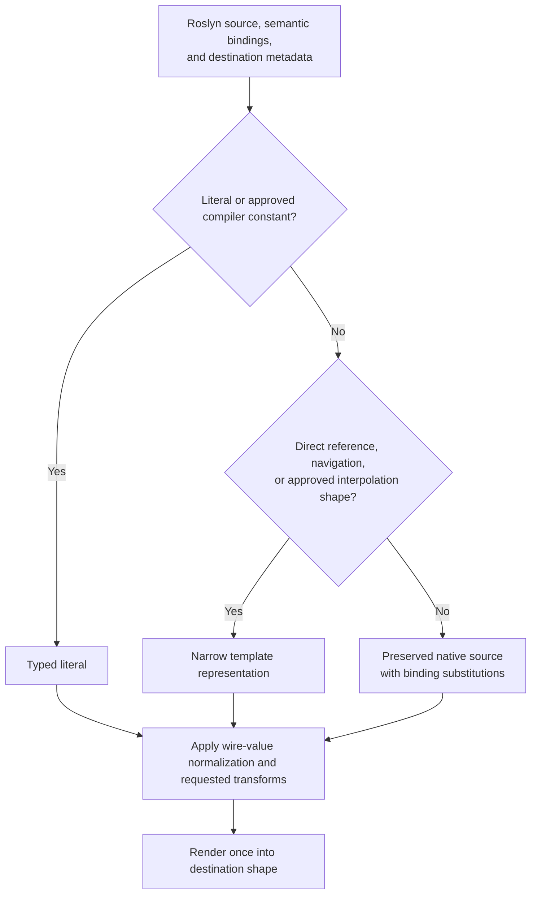

# Logic Apps expression conversion: expected test cases

## Purpose and status

This is a target-behavior test catalog for SDK-integrated Roslyn source
analysis and workflow-reference substitution. It replaces the expression-tree
to C# design, not the user's inline workflow authoring. It is not a description
of the existing implementation or a claim that these cases already pass.

Architecture and additional acceptance tests:
[source-preserving SDK plan](logic-apps-source-expression-sdk-plan.md).
The plan's 90 source/build/package tests are included in full in this catalog;
see [source-specific coverage](#source-specific-coverage). This catalog is the
current selected-contract baseline; older proposal wording in the plan is
historical where it differs.

The tables cover input families, combinations, serialization surfaces, and
failure boundaries. Arbitrary C# has infinitely many combinations; use these
cases as a systematic contract, not a promise that every C# dependency, capture,
or language feature can run in every execution host.

**Review status: recommendations accepted by the user on 2026-09-17.** The
expected outputs below apply those selections. The decision record and
unselected alternatives remain at the bottom for future changes.

**Complete review set: 326 uniquely identified cases**: 210 original catalog
cases, all 90 source/build/package cases, and 26 additional boundary cases
making the selected contracts explicit.

**Selected does not mean implemented or backend-verified.** Capability-gated
cases state both the supported-host result and the required explicit rejection
when the capability is unavailable. No silent policy fallback is permitted.

Quick navigation: [conversion cases](#3-literals-and-safe-captured-values),
[all source/build cases](#source-specific-coverage),
[acceptance criteria](#149-acceptance-criteria),
[selected decisions and alternatives](#15-decision-and-verification-tracker).

## 1. Core rules

1. Preserve literal values and JSON token types without invoking runtime code.
2. Translate direct workflow references and supported workflow-data navigation
   into template expressions when no native operation is needed.
3. Preserve arithmetic, comparisons, Boolean logic, conditional/coalescing
   operators, explicit conversions, and native methods as C#, except
   Roslyn-proven constants folded under rule 1 and explicit wire normalization.
4. Emit one `@csharp{...}` envelope for one expression requiring C#. Never
   concatenate template syntax and C# operators into a mixed-language value.
5. Materialize typed workflow values where C# requires their CLR types.
6. Preserve approved simple interpolated-string source syntax as template
   text. Explicit string.Format, string.Concat, and native operators remain
   C#. Roslyn syntax and semantic symbols distinguish these cases before lowering.
7. Resolve enum constants to wire strings only at a serialization boundary
   requiring a wire value. Preserve enums inside native calculations and calls.
8. Apply metadata-requested base64/URL transforms to the converted value in
   the specified order. Users supply values, not manual encoding boilerplate.
9. Reject unsupported input explicitly; do not execute arbitrary getters,
   methods, or constructors to make conversion succeed.
10. Preserve native syntax; do not retain a handwritten Expression-to-C#
    compatibility renderer or use Expression.ToString as a source serializer.



## 2. Notation and fixtures

- Each input is the body of `() => ...`, unless shown otherwise.
- `T:` means a template/literal string value, without JSON escape characters.
- `C:` means the complete string `@csharp{...}`.
- `J:` means an actual JSON value, not necessarily a string.
- `Body:` means preserved native source whose block/async transport is still
  subject to execution-host verification; it does not invent a supported envelope.
- C# spellings are canonical examples. Equivalent source is acceptable only
  if types, evaluation order, null behavior, and runtime results are preserved.
- A `C:` value stored in JSON is still one JSON string; the JSON serializer
  escapes its quotes. Do not manually escape before expression conversion.
- Imports needed by examples include `System`, `System.Collections.Generic`, `System.Linq`,
  `System.Linq.Expressions`, and `Newtonsoft.Json.Linq`.
- Fixture type names must be resolvable in the compilation host. Fully
  qualifying custom types is acceptable and may be necessary.
- `Setup:` statements execute before the lambda; the expression after
  `Input:` is its body. A stored expression passed directly is labeled.
- `Error:` means no translated value is returned. Earlier generation-time
  NotSupportedException examples now specify rejection intent: report a build
  diagnostic when detectable during source analysis, or an explicit binding
  error when only known during construction. Runtime exceptions such as
  FormatException remain runtime assertions. Exact diagnostic wording is not prescribed.
- Outputs are the selected target contracts. Backend/schema dependencies are
  verification gates, not unanswered preference questions. Alternative outputs
  in section 15 are retained for change review only.

| Fixture | Type and workflow identity |
|---|---|
| `trigger` | HTTP trigger; `TriggerOutput.Body` is `JToken` |
| `source`, `other` | String outputs named `Source`, `Other` |
| `count`, `quantity` | Integer outputs named `Count`, `Quantity` |
| `flag`, `otherFlag` | Boolean outputs named `Flag`, `OtherFlag` |
| `amount` | Decimal output named `Amount` |
| `values` | `List<int>` output named `Values` |
| `variable` | Workflow variable named `message` |
| `sharepoint` | Body action named `GetItems`, returning `ItemsList` |
| `summary` | Body action named `GetSummary`, returning `OrderSummary` |
| `OrderSummary.Total` | Decimal CLR property |
| `ItemsList.Value` | Array property with `[JsonProperty("value")]` |
| `item` | ForEach workflow-item placeholder |
| `ctx` | Agent context whose parameter has a `Name` property |
| `RuntimeValues.NextChoice()` | Public enum-producing method with call counter |
| `RuntimeValues.Text` | Mutable public static string |
| `managedTrigger` | Managed trigger with a `TriggerBody` property |
| `nullableCount` | Nullable integer output named `NullableCount` |
| `tokenSource`, `tokenOther` | `JToken` outputs named `TokenSource`, `TokenOther` |
| `choiceAction` | `WireChoice` output named `Choice` |
| `money` | `Money` output named `Money` |
| `first`, `second` | `OrderSummary` body actions named `First`, `Second` |
| `raw` | `object` output named `Raw` |
| `RuntimeValues.CurrentText` | Static getter returning `Text`, incrementing a getter counter |
| `RuntimeValues.ConstantText` | `const string` equal to `"constant"` |
| `RuntimeValues.ReadonlyText` | `static readonly string` initialized without compiler constant folding |
| `RuntimeValues.NextText()` | Static method returning `"hello"` and incrementing a call counter |
| `RuntimeValues.Accept(WireChoice)` | Static method returning the native enum name |
| `RuntimeValues.CreateHeaders()` | Static method returning a dictionary and incrementing a call counter |

Additional public fixture definitions (available to the emitted-code host):

```csharp
public class LocalLeaf { public string Text { get; set; } }
public class LocalModel { public LocalLeaf Child { get; set; } }
public class NamedBody { public string Body { get; set; } }
public class TriggerNamedModel { public NamedBody TriggerOutput { get; set; } }

public class GetterModel
{
    public int Calls;
    public string Text { get { Calls++; return "hello"; } }
}

public class PayloadModel
{
    [Newtonsoft.Json.JsonProperty("display_name")]
    public string Name { get; set; }

    [Newtonsoft.Json.JsonProperty("enabled")]
    [System.ComponentModel.DefaultValue(true)]
    public bool Enabled { get; set; } = true;
}

public class DisplayModel
{
    public int Id { get; set; }
    public override string ToString() => $"Display:{Id}";
}

public readonly struct Money
{
    public decimal Value { get; }
    public Money(decimal value) => Value = value;
    public static Money operator +(Money a, Money b) => new Money(a.Value + b.Value);
}
```

Enum fixture:

```csharp
public enum WireChoice
{
    [System.Runtime.Serialization.EnumMember(Value = "first /+")]
    First,
    [System.Runtime.Serialization.EnumMember(Value = "second")]
    Second,
    Unannotated
}
```

## 3. Literals and safe captured values

Use the payload/token conversion surface unless otherwise stated.

| ID | Input | Expected output or assertion |
|---|---|---|
| L01 | `"Hello world"` | `J: "Hello world"`; no C# envelope |
| L02 | `""` | `J: ""` |
| L03 | `5` | `J: 5`, integer token |
| L04 | `true` | `J: true`, Boolean token |
| L05 | `2.5` | `J: 2.5`, numeric token |
| L06 | `(object)5` | `J: 5` |
| L06b | `(object)true` | `J: true` |
| L07 | `(string)null` | JSON null; not the string `"null"` |
| L08 | Captured `string message = "hello"; message` | `J: "hello"` |
| L09 | Captured `int n = 7; n` | `J: 7`; no conversion to a string token |
| L10 | Setup: `var model = new LocalModel { Child = new LocalLeaf { Text = "hello" } };` Input: `model.Child.Text` | `J: "hello"` |
| L11 | L10 setup; input: `model.Child.Text.ToUpperInvariant()` | `C: @csharp{"hello".ToUpperInvariant()}` |
| L12 | L10 setup; construct the action using `model.Child.Text`, then assign `model.Child.Text = "changed"` before definition generation | Saved output `J: "hello"`; construction-time snapshot, D07a=A |
| L13 | Setup: `var model = new LocalLeaf { Text = null };` Input: `model.Text` | `J: null`; no generation error |
| L14 | Setup: `var model = new GetterModel();` Input: `model.Text` | `Error: NotSupportedException` identifying captured custom getter `Text`; `model.Calls == 0` |
| L15 | `"say \"hi\" at C:\\temp {triggerBody()}"` | `J: "say \"hi\" at C:\\temp {triggerBody()}"`; JSON escaping represents the original text |
| L16 | Omit an optional action argument, e.g. `Response(headers: null)`, not a lambda returning null | No expression supplied; optional headers field omitted, D05b=A |
| L17 | `1 + 2` in original lambda source | `J: 3` via Roslyn semantic constant analysis; no user code execution, D17=A |
| L18 | `() => (string)null` for a required non-null field `name` | Explicit null-validation error naming `name`; no omission or empty-string substitution |

L15 does not define how a leading `@` is escaped by the workflow serializer.
Test leading-expression-marker strings separately against the destination
contract; do not assume every string containing expression syntax is literal
at runtime.

### Lost expression provenance

```csharp
// For this provenance test only, construct the local value from a body
// placeholder explicitly set to the JSON string "world".
var localBody = new JValue("world");
var message = "hello" + localBody;
```

This makes the snapshot deterministic. The same loss occurs if a workflow
placeholder is read before the lambda; the converter cannot infer its original
source from the resulting string.

| ID | Subsequent input | Expected behavior |
|---|---|---|
| P01 | `() => message` with setup above | `J: "helloworld"`; no workflow reference |
| P02 | `() => message.ToUpperInvariant()` with setup above | `C: @csharp{"helloworld".ToUpperInvariant()}`; runtime result `"HELLOWORLD"` |
| P03 | `() => $"hello{trigger.TriggerOutput.Body}"` | `T: hello@{triggerBody()}` |
| P04 | Store `Expression<Func<string>> messageExpression = () => $"hello{trigger.TriggerOutput.Body}"` in a source-visible, single-origin, non-reassigned local used only by supported SDK calls; pass `messageExpression` | `T: hello@{triggerBody()}` through build-time source tracing and declaration/use transformation, not a runtime Expression renderer; required unchanged-authoring coverage beyond the prototype |
| P04b | Store `Func<string> message = () => $"hello{trigger.TriggerOutput.Body}"` in a single-origin, non-reassigned local; pass `message` | `T: hello@{triggerBody()}`; build tooling traces the lambda and generates bindings without invoking it |
| P04c | `Func<string> message = LoadDelegateFromExternalConfiguration();` then pass `message` | Explicit source-unavailable diagnostic; no delegate invocation or closure-field inspection |
| P05 | Setup: `Expression<Func<string>> e = () => "hello" + localBody; var result = e.Compile().Invoke();` Input: `result` | `J: "helloworld"`; compiling before conversion loses the expression's construction history |

A plain string cannot carry its construction history. Reuse requires a supported
source-analysis/binding mechanism, not delegate invocation or reconstruction of
an arbitrary runtime Expression object. P05 deliberately executes user-authored
code before the action call; the SDK itself must not do so.

## 4. Direct workflow references and navigation

| ID | Input | Expected logical value |
|---|---|---|
| R01 | `trigger.TriggerOutput` | `T: @triggerOutputs()` |
| R02 | `trigger.TriggerOutput.Body` | `T: @triggerBody()` |
| R03 | `managedTrigger.TriggerBody` | `T: @triggerBody()` |
| R04 | `source.Output` | `T: @outputs('Source')` |
| R05 | `sharepoint.Body` | `T: @body('GetItems')` |
| R06 | `sharepoint.Body.Value` | `T: @body('GetItems')['value']` |
| R07 | `variable.Value` | `T: @variables('message')` |
| R08 | `trigger.TriggerOutput.Body["name"]` | `T: @triggerBody()['name']` |
| R09 | `trigger.TriggerOutput.Body["customer"]["name"]` | `T: @triggerBody()['customer']['name']` |
| R10 | `ctx.Parameters.Name` | `T: @agentparameters('Name')` |
| R11 | ForEach `item["name"]` | `T: @item()['name']`; do not serialize placeholder storage |
| R12 | Setup: `var model = new TriggerNamedModel { TriggerOutput = new NamedBody { Body = "local" } };` Input: `model.TriggerOutput.Body` | `J: "local"` |
| R13 | Setup: string output action `quoted` named `"O'Brien"`; input: `quoted.Output` | `T: @outputs('O''Brien')`; apostrophe escaped for template string syntax |
| R13b | Same action; input: `quoted.Output.ToUpperInvariant()` | `C: @csharp{outputs("O'Brien").ToObject<string>().ToUpperInvariant()}` |

The optional-navigation policy must be explicit. Do not add null-safe
operators indiscriminately to C# or template navigation; test absent
properties and null receivers according to the chosen workflow contract.

## 5. Interpolation, concat, and formatting

| ID | Input | Expected output |
|---|---|---|
| S01 | `$"Received request: {trigger.TriggerOutput.Body}"` | `T: Received request: @{triggerBody()}` |
| S02 | `$"First: {source.Output}; second: {other.Output}"` | `T: First: @{outputs('Source')}; second: @{outputs('Other')}` |
| S03 | `$"Name: {trigger.TriggerOutput.Body["name"]}"` | `T: Name: @{triggerBody()['name']}` |
| S04 | `$"Next: {count.Output + 1}"` | `C: @csharp{$"Next: {outputs("Count").ToObject<int>() + 1}"}` |
| S05 | `string.Format("{0:00}", count.Output)` | `C: @csharp{string.Format("{0:00}", outputs("Count").ToObject<int>())}` |
| S06 | `string.Format(System.Globalization.CultureInfo.InvariantCulture, "{0:N2}", amount.Output)` | `C: @csharp{string.Format(System.Globalization.CultureInfo.InvariantCulture, "{0:N2}", outputs("Amount").ToObject<decimal>())}`; `1234.5m` yields `"1,234.50"` |
| S07 | `string.Concat(source.Output.ToUpperInvariant(), other.Output)` | `C: @csharp{string.Concat(outputs("Source").ToObject<string>().ToUpperInvariant(), outputs("Other").ToObject<string>())}` |
| S08 | `string.Join(",", values.Output)` | `C: @csharp{string.Join(",", outputs("Values").ToObject<List<int>>())}` |
| S09 | `$"{{Name}}: {source.Output}; again: {source.Output}"` | **Agreed routing:** `T: {Name}: @{outputs('Source')}; again: @{outputs('Source')}` |
| S09b | `string.Format("{1}/{0}/{1}", source.Output, other.Output)` | `C: @csharp{string.Format("{1}/{0}/{1}", outputs("Source").ToObject<string>(), outputs("Other").ToObject<string>())}`; each argument evaluated once in source order |
| S09c | `string.Format("{{{0,5:00}}}", count.Output)` | `C: @csharp{string.Format("{{{0,5:00}}}", outputs("Count").ToObject<int>())}`; `Count = 3` yields `"{   03}"` |
| S10 | Setup: `string text = "x";` Input: `text.ToString()` | `C: @csharp{"x".ToString()}`; runtime result `"x"` |
| S11 | `$"Model: {new DisplayModel { Id = count.Output }}"` | `C: @csharp{$"Model: {new DisplayModel { Id = outputs("Count").ToObject<int>() }}"}`; Count=3 yields `"Model: Display:3"` using native formatting, D02=A |

### Clarified target: narrow interpolation recognition, native concatenation

The source-based path no longer infers interpolation from lowered Format calls.
Roslyn retains InterpolatedStringExpressionSyntax separately from explicit
invocations. Only approved simple interpolated-string syntax uses the narrow
template path; Format/Concat calls and native operators retain their source.

This supersedes the old S12/S12b identical-expression-tree exception. There is
no general Format parser retained just to infer the user's original spelling.
Simple reference insertion and escaped braces are supported. D01=A selects
workflow formatting for approved direct-reference token types; D02=A keeps
POCO/native computations on the C# formatting path. Actual null/culture/token
representations require host evidence, not assumed .NET equivalence.

| ID | Input | Expected target output |
|---|---|---|
| S12 | `$"Received: {trigger.TriggerOutput.Body}"` | `T: Received: @{triggerBody()}` |
| S12b | `string.Format("Received: {0}", trigger.TriggerOutput.Body)` | `C: @csharp{string.Format("Received: {0}", triggerBody())}`; preserve native token formatting |
| S13 | `"Name: " + source.Output` | `C: @csharp{"Name: " + outputs("Source").ToObject<string>()}` |
| S13b | `string.Concat("Name: ", source.Output)` | `C: @csharp{string.Concat("Name: ", outputs("Source").ToObject<string>())}` |
| S14 | S01 with body fixtures null, `"hello"`, 42, true, `{"n":1}`, and `[1,2]`, in two host cultures | Same template text as S01 for verified supported token kinds; runtime insertion must equal that host's documented workflow-formatting result, not an assumed .NET ToString result. Record exact backend strings before this verification case passes |
| S15 | `$"Count: {count.Output,5:00}"` | `C: @csharp{$"Count: {outputs("Count").ToObject<int>(),5:00}"}`; Count=3 yields `"Count:    03"`; alignment/format clauses remain native |

Relevant source nodes and routes:

```text
S12:
InterpolatedStringExpressionSyntax
  Text: "Received: "
  Interpolation: trigger.TriggerOutput.Body
  -> narrow source-interpolation handler
  -> template composition: literal "Received: " + reference triggerBody()
  -> Received: @{triggerBody()}

S12b:
InvocationExpressionSyntax, symbol = string.Format
  -> preserve invocation and format string; substitute workflow reference
  -> @csharp{string.Format("Received: {0}", triggerBody())}

S13:
BinaryExpressionSyntax: "Name: " + source.Output
  -> preserve native addition; substitute typed workflow reference
  -> @csharp{"Name: " + outputs("Source").ToObject<string>()}

S13b:
InvocationExpressionSyntax, symbol = string.Concat
  -> preserve native call; substitute typed workflow reference
  -> @csharp{string.Concat("Name: ", outputs("Source").ToObject<string>())}
```

Classification happens before rendering; it does not try the old general
LogicConverter and then fall back. Retaining internal template composition
for approved interpolation does not retain general native Concat translation.

Later compiler lowering no longer controls SDK representation selection.
The preserved native source is compiled by the execution host under its
supported language/dependency contract.

## 6. Native operators and typed conversions

Use workflow values for native-operator tests so safe compile-time constant
folding cannot mask the behavior being tested.

| ID | Input | Expected output |
|---|---|---|
| O01 | `count.Output + 2` | `C: @csharp{outputs("Count").ToObject<int>() + 2}` |
| O02 | `count.Output - 2` | `C: @csharp{outputs("Count").ToObject<int>() - 2}` |
| O03 | `count.Output * 3` | `C: @csharp{outputs("Count").ToObject<int>() * 3}` |
| O04 | `count.Output / 2` | `C: @csharp{outputs("Count").ToObject<int>() / 2}` |
| O05 | `count.Output % 2` | `C: @csharp{outputs("Count").ToObject<int>() % 2}` |
| O06 | `count.Output == 5` | `C: @csharp{outputs("Count").ToObject<int>() == 5}` |
| O07 | `count.Output != 5` | `C: @csharp{outputs("Count").ToObject<int>() != 5}` |
| O08 | `count.Output < 5` | `C: @csharp{outputs("Count").ToObject<int>() < 5}` |
| O08b | `count.Output <= 5` | `C: @csharp{outputs("Count").ToObject<int>() <= 5}` |
| O08c | `count.Output > 5` | `C: @csharp{outputs("Count").ToObject<int>() > 5}` |
| O08d | `count.Output >= 5` | `C: @csharp{outputs("Count").ToObject<int>() >= 5}` |
| O09 | `flag.Output && otherFlag.Output` | `C: @csharp{outputs("Flag").ToObject<bool>() && outputs("OtherFlag").ToObject<bool>()}` |
| O10 | `flag.Output \|\| otherFlag.Output` | `C: @csharp{outputs("Flag").ToObject<bool>() \|\| outputs("OtherFlag").ToObject<bool>()}` |
| O10b | `flag.Output & otherFlag.Output` | `C: @csharp{outputs("Flag").ToObject<bool>() & outputs("OtherFlag").ToObject<bool>()}` |
| O10c | `flag.Output \| otherFlag.Output` | `C: @csharp{outputs("Flag").ToObject<bool>() \| outputs("OtherFlag").ToObject<bool>()}` |
| O11 | `!flag.Output` | `C: @csharp{!outputs("Flag").ToObject<bool>()}` |
| O12 | `-count.Output` | `C: @csharp{-outputs("Count").ToObject<int>()}` |
| O13 | `flag.Output ? "yes" : "no"` | `C: @csharp{outputs("Flag").ToObject<bool>() ? "yes" : "no"}` |
| O14 | `source.Output ?? "default"` | `C: @csharp{outputs("Source").ToObject<string>() ?? "default"}` |
| O15 | `(count.Output + 2) * 3` | `C: @csharp{(outputs("Count").ToObject<int>() + 2) * 3}` |
| O16 | `count.Output - (quantity.Output - 1)` | `C: @csharp{outputs("Count").ToObject<int>() - (outputs("Quantity").ToObject<int>() - 1)}` |
| O17 | `count.Output << 1` | `C: @csharp{outputs("Count").ToObject<int>() << 1}` |
| O17b | `count.Output & 3` | `C: @csharp{outputs("Count").ToObject<int>() & 3}` |
| O17c | `count.Output \| 3` | `C: @csharp{outputs("Count").ToObject<int>() \| 3}` |
| O17d | `count.Output ^ 3` | `C: @csharp{outputs("Count").ToObject<int>() ^ 3}` |
| O17e | `~count.Output` | `C: @csharp{~outputs("Count").ToObject<int>()}` |
| O18 | `checked(count.Output + 1)` | `C: @csharp{checked(outputs("Count").ToObject<int>() + 1)}`; `int.MaxValue` throws `OverflowException` |
| O19 | `(int)amount.Output` | `C: @csharp{(int)outputs("Amount").ToObject<decimal>()}`; `2.75m` yields `2` |
| O20 | `money.Output + new Money(2m)` | `C: @csharp{outputs("Money").ToObject<Money>() + new Money(2m)}`; invokes `Money.operator +` |
| O21 | `nullableCount.Output + 2` | `C: @csharp{outputs("NullableCount").ToObject<int?>() + 2}`; null yields null, `3` yields `5` |
| O22 | `tokenSource.Output == tokenOther.Output` | `C: @csharp{outputs("TokenSource") == outputs("TokenOther")}`; native equality, not automatic JToken.DeepEquals |
| O22b | O22 with two distinct JToken instances having equal JSON content | Same emitted source as O22; false for statically JToken reference equality; same instance compares true; verify actual helper-return typing |
| O22c | `JToken.DeepEquals(tokenSource.Output, tokenOther.Output)` | `C: @csharp{JToken.DeepEquals(outputs("TokenSource"), outputs("TokenOther"))}`; explicitly requested deep equality returns true for equal content |
| O22d | O22 with CLR null/null, null/non-null, and distinct unequal-content JTokens | Native equality gives true, false, false respectively with statically JToken helpers; a JSON-null JValue is not silently converted to a CLR-null reference |

For O04, `count = 5` must yield integer `2`, not floating-point `2.5`.
For O09/O10, use counter-bearing right operands to prove evaluation order.
For O18, test overflow at the boundary, not just normal arithmetic.

### Mixed JSON navigation and arithmetic

| ID | Input | Expected output or behavior |
|---|---|---|
| M01 | `trigger.TriggerOutput.Body["value"].Value<int>() + 2` | `C: @csharp{triggerBody()["value"].Value<int>() + 2}` |
| M02 | `trigger.TriggerOutput.Body["value"].ToObject<int>() + 2` | `C: @csharp{triggerBody()["value"].ToObject<int>() + 2}` |
| M03 | `trigger.TriggerOutput.Body["name"].Value<string>().ToUpperInvariant()` | `C: @csharp{triggerBody()["name"].Value<string>().ToUpperInvariant()}` |
| M04 | `trigger.TriggerOutput.Body["count"].Value<int>() >= 10` | `C: @csharp{triggerBody()["count"].Value<int>() >= 10}` |
| M05 | `flag.Output ? count.Output + 1 : 0` | `C: @csharp{outputs("Flag").ToObject<bool>() ? outputs("Count").ToObject<int>() + 1 : 0}` |
| M06 | `trigger.TriggerOutput.Body["value"] + 2` | Reject at user compilation if operands do not support the operator; do not infer an integer |
| M07 | `trigger.TriggerOutput.Body["value"].Value<int>() + 2` | `C: @csharp{triggerBody()["value"].Value<int>() + 2}`; forbidden output: `@triggerBody()['value'] + 2` |
| M08 | `trigger.TriggerOutput.Body["value"].Value<int>()`; runtime body `{"value":"abc"}` | `C: @csharp{triggerBody()["value"].Value<int>()}`; runtime `FormatException`, not a template reference |
| M09 | `trigger.TriggerOutput.Body["value"].Value<int?>()`; runtime body `{"value":null}` | `C: @csharp{triggerBody()["value"].Value<int?>()}`; runtime null |
| M09b | `trigger.TriggerOutput.Body["value"].ToObject<int>()`; runtime body `{}` | `C: @csharp{triggerBody()["value"].ToObject<int>()}`; null receiver causes runtime `NullReferenceException` |

Do not treat `Value<T>()` and `ToObject<T>()` as universally interchangeable.
Their input handling can differ. Preserve the user's explicit operation unless
equivalence for the supported input domain is established.

## 7. Native methods, runtime members, and collections

| ID | Input | Expected output or assertion |
|---|---|---|
| N01 | `source.Output.ToUpperInvariant()` | `C: @csharp{outputs("Source").ToObject<string>().ToUpperInvariant()}` |
| N02 | `source.Output.Length` | `C: @csharp{outputs("Source").ToObject<string>().Length}` |
| N03 | `source.Output.Substring(1, 2)` | `C: @csharp{outputs("Source").ToObject<string>().Substring(1, 2)}` |
| N04 | `count.Output.ToString()` | `C: @csharp{outputs("Count").ToObject<int>().ToString()}` |
| N05 | `Math.Round(amount.Output, 2)` | `C: @csharp{Math.Round(outputs("Amount").ToObject<decimal>(), 2)}` |
| N06 | `DateTime.UtcNow` | `C: @csharp{System.DateTime.UtcNow}`; no generation-time timestamp |
| N07 | `RuntimeValues.Text.ToUpperInvariant()` | `C: @csharp{RuntimeValues.Text.ToUpperInvariant()}`; `Text = "hello"` yields `"HELLO"` |
| N08 | `RuntimeValues.CurrentText` | `C: @csharp{RuntimeValues.CurrentText}`; zero generation getter calls; one runtime getter call |
| N09 | `RuntimeValues.ConstantText` | `J: "constant"` |
| N10 | `RuntimeValues.ReadonlyText` | `C: @csharp{RuntimeValues.ReadonlyText}` |
| N11 | `values.Output[1]` | `C: @csharp{outputs("Values").ToObject<List<int>>()[1]}` |
| N12 | `values.Output.Where(x => x > 1).Select(x => x * 2).ToArray()` | `C: @csharp{outputs("Values").ToObject<List<int>>().Where(x => x > 1).Select(x => x * 2).ToArray()}` |
| N13 | Setup: `var numbers = new[] { 1, 2 };` Input: `numbers[0]` | `C: @csharp{new[] { 1, 2 }[0]}`; runtime `1` |
| N14 | Setup: `var names = new List<string> { "a", "b" };` Input: `names[1]` | `C: @csharp{new List<string> { "a", "b" }[1]}`; runtime `"b"` |
| N14b | Setup: `var lookup = new Dictionary<string, int> { ["k"] = 7 };` Input: `lookup["k"]` | `C: @csharp{new Dictionary<string, int> { ["k"] = 7 }["k"]}`; runtime `7` |
| N15 | `summary.Body.Total * 1.2m` | `C: @csharp{body("GetSummary").ToObject<OrderSummary>().Total * 1.2m}` |
| N16 | `new Uri(source.Output)` | `C: @csharp{new Uri(outputs("Source").ToObject<string>())}`; ensure destination accepts/serializes URI result |
| N17 | Setup: `var uri = new Uri("https://example.com/api");` Input: `uri` at HTTP URI boundary | `T: https://example.com/api` |
| N17b | `System.Net.Http.HttpMethod.Get` at HTTP method boundary | `T: GET` |
| N18 | `raw.Output is string` | `C: @csharp{outputs("Raw").ToObject<object>() is string}`; preserve declared-object materialization and type test |
| N18b | `new Money(amount.Output)` | `C: @csharp{new Money(outputs("Amount").ToObject<decimal>())}`; no generation-time constructor call |
| N18c | `default(int)` | `J: 0` under selected semantic-constant policy D17=A |

Short type names in examples must not conceal missing runtime assemblies,
namespaces, generic arguments, or nested type qualification.

## 8. Structured payloads

### Q01: literals and direct workflow leaves

Input:

```csharp
() => new
{
    enabled = true,
    count = 3,
    body = trigger.TriggerOutput.Body,
    message = $"Output: {source.Output}",
    labels = new[] { "a", "b" }
}
```

Expected payload:

```json
{
  "enabled": true,
  "count": 3,
  "body": "@triggerBody()",
  "message": "Output: @{outputs('Source')}",
  "labels": ["a", "b"]
}
```

### Q02: one expression constructing an object with calculations

Input:

```csharp
() => new
{
    Next = count.Output + 1,
    Accepted = flag.Output && count.Output > 0
}
```

Expected logical value:

```text
@csharp{new { Next = outputs("Count").ToObject<int>() + 1, Accepted = outputs("Flag").ToObject<bool>() && outputs("Count").ToObject<int>() > 0 }}
```

Runtime: `Count = 3`, `Flag = true` yields `{ Next = 4, Accepted = true }`.

| ID | Case | Expected assertion |
|---|---|---|
| Q03 | `new { nested = new { body = trigger.TriggerOutput.Body }, labels = new[] { "a", "b" } }` | `J: {"nested":{"body":"@triggerBody()"},"labels":["a","b"]}` |
| Q04 | `new PayloadModel { Name = source.Output }`; generated destination metadata explicitly declares wire names and default enabled=true | `J: {"display_name":"@outputs('Source')","enabled":true}`; constructor not executed; DefaultValue attribute alone is not authority |
| Q04b | Q04 with explicit `Enabled = false` | `J: {"display_name":"@outputs('Source')","enabled":false}`; explicit assignment overrides default metadata |
| Q04c | Q04 with conflicting authoritative default metadata versions | Explicit metadata conflict/version error; do not pick a default or run a constructor |
| Q05 | `new Dictionary<string, string> { { "X-Name", source.Output }, { "X-Upper", other.Output.ToUpperInvariant() } }` at headers boundary | Dictionary serialized as `J: {"X-Name":"@outputs('Source')","X-Upper":"@csharp{outputs(\"Other\").ToObject<string>().ToUpperInvariant()}"}` |
| Q06 | `RuntimeValues.CreateHeaders()` at a headers boundary that requires a generation-time dictionary | `Error: NotSupportedException` identifying executable headers expression; zero method calls |
| Q06b | `RuntimeValues.CreateHeaders()` at a verified runtime-object-capable destination with approved helper dependency | `C: @csharp{RuntimeValues.CreateHeaders()}`; zero generation calls, one runtime call; returned dictionary becomes the destination value |
| Q07 | Setup: `var payload = JObject.Parse("{\"n\":1}");` Input: `payload`; mutate original `payload["n"] = 2` after conversion | Saved output `J: {"n":1}` |
| Q07b | Setup: `var payload = new JArray(1, 2);` Input: `payload` | `J: [1,2]`, cloned rather than aliased |
| Q08 | Setup: `var model = new DisplayModel { Id = 1 };` Input: `model` at a boundary without captured-POCO serialization support | `Error: NotSupportedException` identifying unsupported captured `DisplayModel`; no `ToString()` call |
| Q09 | Generated fields: `name: () => source.Output`, `count: () => 3`, `label: () => other.Output.ToUpperInvariant()` | `J: {"name":"@outputs('Source')","count":3,"label":"@csharp{outputs(\"Other\").ToObject<string>().ToUpperInvariant()}"}` |

Q02 and Q09 are different: a single calculated lambda may become one C#
expression, while a generated connector can assemble independently converted
parameters into a mixed JSON payload.

## 9. Enum wire-value conversion

These cases apply when the destination requires an enum's connector wire
string, not to every enum appearing anywhere in a C# expression.
Unless explicitly closed, fixtures use an open destination permitting the
documented name/numeric fallback. Closed destinations reject unmapped results,
including runtime-produced values.

| ID | Input | Expected output or assertion |
|---|---|---|
| E01 | `WireChoice.First` | Literal `"first /+"` |
| E02 | `WireChoice.Second` | Literal `"second"` |
| E03 | `WireChoice.Unannotated` | Literal `"Unannotated"` |
| E04 | Setup: `var choice = WireChoice.First;` Input: `choice` | `J: "first /+"` |
| E05 | `flag.Output ? WireChoice.First : WireChoice.Second` | `C: @csharp{outputs("Flag").ToObject<bool>() ? "first /+" : "second"}` |
| E06 | `flag.Output ? WireChoice.First : (otherFlag.Output ? WireChoice.Second : WireChoice.Unannotated)` | `C: @csharp{outputs("Flag").ToObject<bool>() ? "first /+" : (outputs("OtherFlag").ToObject<bool>() ? "second" : "Unannotated")}` |
| E07 | `RuntimeValues.NextChoice()` | Exact switch expression in E07 block below; one runtime method call |
| E08 | `flag.Output ? WireChoice.First : RuntimeValues.NextChoice()` | `C: @csharp{outputs("Flag").ToObject<bool>() ? "first /+" : (RuntimeValues.NextChoice() switch { WireChoice.First => "first /+", WireChoice.Second => "second", WireChoice.Unannotated => "Unannotated", var value => value.ToString() })}` |
| E09 | Undefined enum value `(WireChoice)99` at an open enum-wire boundary | `J: "99"`; numeric fallback allowed by open schema |
| E09b | `(WireChoice)99` at a closed enum-wire boundary allowing only declared mapped values | Explicit enum validation error; no numeric fallback bypassing the closed schema |
| E10 | `choiceAction.Output == WireChoice.First` | `C: @csharp{outputs("Choice").ToObject<WireChoice>() == WireChoice.First}` |
| E11 | `RuntimeValues.Accept(choiceAction.Output)` | `C: @csharp{RuntimeValues.Accept(outputs("Choice").ToObject<WireChoice>())}` |
| E12 | `WireChoice.First.ToString()` at a string-result boundary | `C: @csharp{WireChoice.First.ToString()}`; runtime `"First"` |
| E13 | Setup: `enum AliasChoice { [System.Runtime.Serialization.EnumMember(Value = "a")] A = 0, [System.Runtime.Serialization.EnumMember(Value = "b")] B = 0 }`; input: `AliasChoice.A` | Explicit conflicting-alias error for value 0; no declaration-order selection |
| E13b | Setup: `[Flags] enum Access { Read = 1, Write = 2 }`; captured `var access = Access.Read \| Access.Write;`; input: `access` at an open wire boundary | `J: "Read, Write"`; approved name fallback for open schema |
| E13c | Setup: `WireChoice? choice = null;`; input: `choice` at nullable JSON wire boundary | `J: null`; not `"null"` |
| E13d | Aliases A=0 and B=0 both have EnumMember value `"a"`; input: A | `J: "a"`; one mapping per numeric value, no duplicate runtime switch arms |
| E13e | E13b flags value at a closed boundary with no mapping for combined value 3 | Explicit unmapped-enum error; do not invent a composite wire value |
| E13f | Nullable enum `choice = null` at a required non-null wire boundary | Explicit null-validation error naming the destination |

E07 conceptual output:

```text
@csharp{RuntimeValues.NextChoice() switch { WireChoice.First => "first /+", WireChoice.Second => "second", WireChoice.Unannotated => "Unannotated", var value => value.ToString() }}
```

A runtime helper is also acceptable if available in the host. The required
contract is mapping and single evaluation, not mandatory switch syntax.
Known string branches need neither a switch nor `.ToString()` calls.

## 10. Base64: equivalent coverage for every supported input category

The destination metadata requests base64. The user does not need to encode
manually. Normalize the value according to its destination contract, then
encode the whole value exactly once.

```text
User expression
  -> literal / template / C# conversion
  -> enum wire mapping or schema-required serialization
  -> base64
  -> optional URL encoding if destination requires it
```

`base64(...)` in C# examples denotes a required backend helper, not a BCL
method. Verify its supported types in the execution host.

For the selected normalization cases B11-B19 and X06, use these explicit
test contracts: text is UTF-8, binary is raw bytes, numbers use invariant
text, Booleans use lowercase text, and complex values use compact Newtonsoft
JSON with declared wire property names. A null optional value stays JSON null;
a missing expression omits the field. Raw-input metadata always encodes once,
even when the input looks encoded; explicit already-encoded metadata passes
the value through when that mode is supported by authoritative metadata.
These selections still require backend/schema verification; unsupported types
and modes are rejected explicitly. They are not grounds for arbitrary ToString.

| ID | Input to base64-marked destination | Expected output or contract |
|---|---|---|
| B01 | `"hello"` | `T: @base64('hello')`; decoded UTF-8 text is `hello` |
| B02 | `source.Output` | `T: @base64(outputs('Source'))` |
| B03 | `trigger.TriggerOutput.Body["content"]` | `T: @base64(triggerBody()['content'])` for a supported content value |
| B04 | `source.Output.ToUpperInvariant()` | `C: @csharp{base64(outputs("Source").ToObject<string>().ToUpperInvariant())}` |
| B05 | `(count.Output + 1).ToString()` | `C: @csharp{base64((outputs("Count").ToObject<int>() + 1).ToString())}` |
| B06 | `$"Name: {source.Output}"` | `T: @base64(concat('Name: ', outputs('Source')))` |
| B07 | `$"Next: {count.Output + 1}"` | `C: @csharp{base64($"Next: {outputs("Count").ToObject<int>() + 1}")}` |
| B08 | `WireChoice.First` | `T: @base64('first /+')` |
| B09 | `flag.Output ? WireChoice.First : WireChoice.Second` | `C: @csharp{base64(outputs("Flag").ToObject<bool>() ? "first /+" : "second")}` |
| B10 | `RuntimeValues.NextChoice()` | `C: @csharp{base64(RuntimeValues.NextChoice() switch { WireChoice.First => "first /+", WireChoice.Second => "second", WireChoice.Unannotated => "Unannotated", var value => value.ToString() })}` |
| B11 | Setup: `byte[] bytes = { 0, 1, 255 };` Input: `bytes` | `J: "AAH/"`; decoded bytes `00 01 FF`, not JSON-array bytes |
| B12 | `42` | `T: @base64('42')`; invariant text; evaluated `"NDI="` |
| B12b | `true` | `T: @base64('true')`; lowercase text; evaluated `"dHJ1ZQ=="` |
| B12c | `amount.Output + 1m` | `C: @csharp{base64((outputs("Amount").ToObject<decimal>() + 1m).ToString(System.Globalization.CultureInfo.InvariantCulture))}` |
| B13 | Setup: `var uri = new Uri("https://example.com/api");` Input: `uri` at encoded URI boundary | `T: @base64('https://example.com/api')`; schema-approved URI normalization |
| B13b | `System.Net.Http.HttpMethod.Get` at encoded HTTP method boundary | `T: @base64('GET')`; schema-approved HTTP method normalization |
| B14 | Setup: `JToken token = new JValue("hello");` Input: `token` | `T: @base64('hello')`; decoded `hello`, without JSON quotes |
| B14b | Setup: `JToken token = JObject.Parse("{\"n\":1}");` Input: `token` | `T: @base64('{"n":1}')`; compact JSON, evaluated `"eyJuIjoxfQ=="` |
| B15 | `new { n = 1 }` | `T: @base64('{"n":1}')`; whole-object compact JSON |
| B15b | `new[] { 1, 2 }` | `T: @base64('[1,2]')`; whole-array compact JSON, evaluated `"WzEsMl0="` |
| B15c | B14b/B15/B15b with application JsonConvert.DefaultSettings changed to indentation or different naming | Same selected compact wire bytes as their baseline cases; application ambient settings cannot change the SDK's fixed serializer profile |
| B16 | `""` | `T: @base64('')`; evaluated `""` |
| B16b | `"\u00e9"` | `T: @base64('é')`; UTF-8, evaluated `"w6k="`; decoded code point U+00E9 |
| B16c | Setup: `byte[] bytes = { 0, 0 };` Input: `bytes` | `J: "AAA="`; raw bytes |
| B17 | Omitted/null action argument for optional field `content` (no lambda supplied) | Generated object `J: {}` |
| B17b | `() => (string)null` for optional nullable field `content` | Generated object `J: {"content":null}`; no base64 call |
| B17c | `() => (string)null` for required non-null encoded field `content` | Explicit null-validation error; do not encode empty text or JSON null |
| B18 | Setup: `var stream = new System.IO.MemoryStream();` Input: `stream` for text-only encoded `content` | `Error: NotSupportedException` identifying destination `content` and unsupported `MemoryStream`; no `ToString()` or stream read |
| B19 | `"aGVsbG8="` for raw-input base64 metadata | `T: @base64('aGVsbG8=')`; evaluated `"YUdWc2JHOD0="`; no appearance-based guessing |
| B19b | `"aGVsbG8="` for authoritative already-encoded metadata supported by the destination | `J: "aGVsbG8="`; pass through exactly once |
| B19c | Request already-encoded mode where the schema/descriptor supports only raw input | Explicit unsupported-metadata diagnostic; ordinary raw input continues to use B19 |
| B20 | `RuntimeValues.NextText()` | `C: @csharp{base64(RuntimeValues.NextText())}`; zero generation calls, one runtime call; evaluated `"aGVsbG8="` |

B06 uses `concat` internally to represent supported interpolation within a
template function. Removing general native concat translation does not remove
this template composition primitive.

### B21: mixed encoded and unencoded generated fields

Only `ContentData` is marked for encoding. Independent user inputs are:

```csharp
// ContentData
() => trigger.TriggerOutput.Body["content"]

// ContentType
() => "text/plain"

// Label
() => source.Output.ToUpperInvariant()
```

Expected generated payload:

```json
{
  "ContentData": "@base64(triggerBody()['content'])",
  "ContentType": "text/plain",
  "Label": "@csharp{outputs(\"Source\").ToObject<string>().ToUpperInvariant()}"
}
```

Only the marked property is encoded. No user calls a base64 converter.

### B22: nested property metadata

Input for a generated destination whose schema marks only each
`items[*].content` string for base64:

```csharp
() => new
{
    items = new[]
    {
        new { content = "hello", label = "plain" },
        new { content = source.Output, label = "reference" }
    },
    enabled = true
}
```

Expected JSON under that metadata:

```json
{
  "items": [
    { "content": "@base64('hello')", "label": "plain" },
    { "content": "@base64(outputs('Source'))", "label": "reference" }
  ],
  "enabled": true
}
```

The metadata selects the members, not their names. Neither `items` nor the
whole object is encoded.

## 11. URL encoding, generated paths, and workflow helpers

| ID | Case | Expected output or assertion |
|---|---|---|
| U01 | `source.Output`, URL encoding once | `T: @{encodeURIComponent(outputs('Source'))}` |
| U02 | `source.Output`, URL encoding twice | `T: @{encodeURIComponent(encodeURIComponent(outputs('Source')))}` |
| U03 | `source.Output.ToUpperInvariant()`, once | `C: @csharp{encodeURIComponent(outputs("Source").ToObject<string>().ToUpperInvariant())}` |
| U04 | `WireChoice.First`, URL encoding once | `T: @{encodeURIComponent('first /+')}`; evaluated `first%20%2F%2B` |
| U05 | `WireChoice.First`, URL encoding twice | `T: @{encodeURIComponent(encodeURIComponent('first /+'))}`; evaluated `first%2520%252F%252B` |
| U06 | Generated path format `"/items/{0}/{1}"`; args `() => source.Output`, `() => other.Output`; each URL-encoded once | `T: /items/@{encodeURIComponent(outputs('Source'))}/@{encodeURIComponent(outputs('Other'))}` |
| U07 | Same path format; args `() => source.Output.ToUpperInvariant()`, `() => other.Output`; each URL-encoded once | `C: @csharp{string.Format("/items/{0}/{1}", encodeURIComponent(outputs("Source").ToObject<string>().ToUpperInvariant()), encodeURIComponent(outputs("Other").ToObject<string>()))}` |
| U08 | `"hello"` with base64 followed by one URL encoding | `T: @{encodeURIComponent(base64('hello'))}`; evaluated `aGVsbG8%3D` |
| U09 | Path format `"/items/{0}/{1}"`; args `() => RuntimeValues.NextText()`, `() => source.Output`; each URL-encoded once | `C: @csharp{string.Format("/items/{0}/{1}", encodeURIComponent(RuntimeValues.NextText()), encodeURIComponent(outputs("Source").ToObject<string>()))}`; method called once before second argument |
| U10 | `WorkflowFunctions.ToJson<JObject>(source.Output)` | `T: @json(outputs('Source'))` |
| U11 | `WorkflowFunctions.ToJson<JObject>(source.Output.ToUpperInvariant())` | `C: @csharp{json(outputs("Source").ToObject<string>().ToUpperInvariant())}`; no additional native consumer requiring `JObject` materialization |

Verify URL-safe escaping using the actual workflow helper contract. Base64
and URL encoding are distinct transforms; neither implies the other.

## 12. Composite runtime cases

### X01: precedence and integer arithmetic

```csharp
() => (count.Output + 2) * 3 - quantity.Output / 2
```

```text
@csharp{(outputs("Count").ToObject<int>() + 2) * 3 - outputs("Quantity").ToObject<int>() / 2}
```

Runtime fixture: `Count = 4`, `Quantity = 5` yields `16`.

### X02: short-circuit guard

```csharp
() => source.Output != null && source.Output.StartsWith("A")
```

```text
@csharp{outputs("Source").ToObject<string>() != null && outputs("Source").ToObject<string>().StartsWith("A")}
```

Runtime: null yields false without invoking `StartsWith`; `"Alice"` yields
true; `"Bob"` yields false.

### X03: conditional laziness with enum wire results

```csharp
() => flag.Output ? WireChoice.First : RuntimeValues.NextChoice()
```

```text
@csharp{outputs("Flag").ToObject<bool>() ? "first /+" : (RuntimeValues.NextChoice() switch { WireChoice.First => "first /+", WireChoice.Second => "second", WireChoice.Unannotated => "Unannotated", var value => value.ToString() })}
```

True branch yields `"first /+"` with zero enum-method calls. False branch maps
the method result with exactly one call. Conversion invokes neither branch.

### X04: two typed action bodies

```csharp
() => first.Body.Total + second.Body.Total >= 1000m
```

```text
@csharp{body("First").ToObject<OrderSummary>().Total + body("Second").ToObject<OrderSummary>().Total >= 1000m}
```

Use decimal totals around `1000m` and verify boundary results.

### X05: nested LINQ over a typed connector body

```csharp
() => sharepoint.Body.Value
    .Where(entry => entry.DynamicProperties["active"].Value<bool>())
    .Select(entry => entry.DynamicProperties["name"].Value<string>())
    .ToArray()
```

```text
@csharp{body("GetItems").ToObject<ItemsList>().Value.Where(entry => entry.DynamicProperties["active"].Value<bool>()).Select(entry => entry.DynamicProperties["name"].Value<string>()).ToArray()}
```

Supply active/inactive entries and verify selected names, order, empty
results, and conversion errors for malformed fields.

### X06: encoded calculated payload

For a destination explicitly requiring base64 of JSON:

```csharp
() => new { Next = count.Output + 1, Label = source.Output }
```

Selected output under the shared compact JSON contract in section 10, with
the Newtonsoft dependency explicitly approved and available in the backend:

```text
@csharp{base64(Newtonsoft.Json.JsonConvert.SerializeObject(new { Next = outputs("Count").ToObject<int>() + 1, Label = outputs("Source").ToObject<string>() }, Newtonsoft.Json.Formatting.None))}
```

For `Count = 3`, `Source = "A"`, the decoded UTF-8 text is
`{"Next":4,"Label":"A"}`. The JSON object retains a numeric `Next` and string
`Label`. Construct at runtime, serialize once, and encode once; do not encode
the source code or the CLR type name.

The call above illustrates serialization order in a host pinned to the shared
wire profile. A bare SerializeObject call is not sufficient in an arbitrary
host: the production serializer must explicitly enforce the fixed settings,
names and dependencies, even when ambient JsonConvert.DefaultSettings changes.
X06 and B15c must still produce the same bytes under that mutation.

## 13. Failure and boundary tests

| ID | Case | Required behavior |
|---|---|---|
| F01 | `Func<int> e = () => "hello";` | User compilation rejects string-to-int result; no emitted expression |
| F02 | Inline action lambda `() => { return count.Output + 1; }` | `Body: { return outputs("Count").ToObject<int>() + 1; }`; verified block-capable host yields 4 for Count=3. Until that capability is verified, reject with host-capability diagnostic; no invented transport, D16=A |
| F03 | Pass `Expression.Lambda<Func<int>>(Expression.Block(Expression.Constant(1)))` to an action | Explicit API/source-availability rejection for a runtime-constructed Expression; source-traceable delegates are supported separately, D14=B |
| F04 | Setup: `var model = new GetterModel();` Input: `model.Text` | `Error: NotSupportedException` identifying captured custom getter `Text`; `model.Calls == 0` |
| F05 | `new Money(amount.Output)`; compile emitted source in a host deliberately lacking the `Money` fixture assembly | Candidate `C: @csharp{new Money(outputs("Amount").ToObject<decimal>())}`; emitted-code compilation fails identifying missing type `Money`, not a runtime-ready success |
| F06 | `count.Output / quantity.Output`; runtime `Quantity = 0` | `C: @csharp{outputs("Count").ToObject<int>() / outputs("Quantity").ToObject<int>()}`; runtime `DivideByZeroException` |
| F07 | Setup: `var stream = new System.IO.MemoryStream();` Input: `stream` for text-only base64 field `content` | `Error: NotSupportedException` identifying `content`, `MemoryStream`, and unsupported encoding normalization |
| F08 | `"@csharp{1 + 2}"` as literal user data on a host with verified leading-@ escaping | Stored `J: "@@csharp{1 + 2}"`; workflow evaluation returns literal text `@csharp{1 + 2}`, never executes it |
| F08b | F08 input on a host with no verified safe literal-marker transport | Explicit unsupported-literal-transport diagnostic; never emit an executable marker unchanged |
| F09 | `source.Output.ToUpperInvariant()` at a base64 destination | `C: @csharp{base64(outputs("Source").ToObject<string>().ToUpperInvariant())}`; exactly one envelope, not `base64(@csharp{...})` |
| F10 | Setup: `string text = "a\"b\\c";` Input: `text.ToUpperInvariant()` | Logical `C: @csharp{"a\"b\\c".ToUpperInvariant()}`; stored JSON string `"@csharp{\"a\\\"b\\\\c\".ToUpperInvariant()}"`; runtime text `A"B\C` |

F08 deliberately separates literal-data protection from source analysis.
The selected leading-`@` escape path requires backend confirmation;
returning the unescaped marker is not an acceptable way to preserve literal
data if the runtime would execute it.

## 14. Cross-surface coverage

Do not mechanically repeat every case on every API. Test each semantic family
on its owning renderer and representative integration surfaces.

| Surface | Concrete representative cases |
|---|---|
| Scalar conversion | L01, R04, S01, O01, N01, M02; each supplies exact input/output |
| Token conversion / Compose | L03-L07, Q01-Q03; C# results are stored as a JSON string, as in Q09 |
| Managed connector query/body/path | Q09 fields, E05 enum wire string, U06/U07 paths, B21 payload |
| Service provider parameters | Q09 field values and B21 encoding, with the same expected JSON values |
| Headers/query dictionaries | Q05 exact dictionary and Q06 rejection |
| Response status | I01-I03 below |
| Condition / Until / Switch | I04-I06 below |
| ForEach | R11 item reference, I07 collection reference, I08 computed collection |
| Agent parameters | R10 direct reference and I09 native consumer |
| Generated base64 fields | B02, B04, B09, B21, B22 |

The following integration cases specify the serialized expression/status
field, not an invented full action schema. Setups are boundary descriptions,
not new SDK method names.

| ID | Input and surface | Expected serialized field |
|---|---|---|
| I01 | Missing Response status expression | Preserve absence through expression handling; Response action applies default `J: 200`, D06=A |
| I02 | `() => System.Net.HttpStatusCode.Accepted` for Response status | `J: 202` |
| I03 | `() => (System.Net.HttpStatusCode)count.Output` for Response status | `J: "@csharp{(int)(System.Net.HttpStatusCode)outputs(\"Count\").ToObject<int>()}"` |
| I04 | `() => count.Output == 3` for Condition expression on a verified supporting runtime/designer | `J: "@csharp{outputs(\"Count\").ToObject<int>() == 3}"`; no automatic equality-object substitution |
| I04b | I04 on an unsupported/unverified Condition host | Capability diagnostic or blocked deployment; any designer-specific equality-object exception requires an explicit decision revision |
| I05 | `() => count.Output >= 3` for Until expression | `J: "@csharp{outputs(\"Count\").ToObject<int>() >= 3}"` |
| I06 | `() => count.Output + 1` for Switch selector | `J: "@csharp{outputs(\"Count\").ToObject<int>() + 1}"` |
| I07 | `() => values.Output` for ForEach collection | `J: "@outputs('Values')"` |
| I08 | `() => values.Output.Where(x => x > 1).ToArray()` for ForEach collection | `J: "@csharp{outputs(\"Values\").ToObject<List<int>>().Where(x => x > 1).ToArray()}"` |
| I09 | `() => ctx.Parameters.Name.ToUpperInvariant()` for a string agent-parameter consumer | `J: "@csharp{agentparameters(\"Name\").ToObject<string>().ToUpperInvariant()}"` |
| I10 | `() => default(System.Net.HttpStatusCode)` for Response status | Reject explicit status 0 as invalid; do not confuse with missing status, D06=A |

Ordinary predicates and the selected Condition target preserve C# comparisons.
Condition support remains a verification gate; a failed gate does not silently
switch the chosen serialization policy.

### Source-specific coverage

The 90 cases originally in the source-based plan are now reproduced below,
updated for the selected contracts. Existing IDs are preserved; the added
edge cases distinguish supported and unsupported capability/schema profiles.
These are acceptance targets, not a claim of passing production tests.

| Case group | Linked tests | Purpose |
|---|---|---|
| SR01-SR20 | [Source routing and native syntax](#142-original-syntax-routing-and-native-preservation) | Explicit Format versus interpolation, patterns, ranges, switch, block/async, constants, LINQ, null-conditional |
| CB01-CB16 | [Bindings and captures](#143-workflow-bindings-captures-and-evaluation) | Snapshot timing, final names, escaping, lazy access, loops, helper parameters, provenance |
| SC01-SC08 | [Semantic context](#144-semantic-context-and-dependencies) | Aliases, imports, overloads, checked/generic contexts, dependency availability |
| IN01-IN14 | [Real SDK integration](#145-real-sdk-surfaces-and-destination-tests) | Existing authoring, connectors, headers, enum/status/encoding and agent surfaces |
| PK01-PK20 | [Package and build](#146-build-packaging-and-tooling-tests) | SDK-only package consumption, unchanged source, incremental/IDE/multi-target behavior |
| DG01-DG12 | [Rejections and host gates](#147-rejections-safety-and-host-boundaries) | Non-inline values, unsupported captures/dependencies, missing host features, literal-data protection |

### 14.1 Notation and fixtures

Inputs are lambda bodies unless a complete statement/call is shown.

- `C:` is the complete logical @csharp string, before JSON escaping.
- `T:` is template text.
- `J:` is the JSON value stored in the action.
- `Body:` is preserved C# source whose transport still depends on a host gate.
- Equivalent type qualification/whitespace is acceptable; semantic differences
  are not. Format/Concat and interpolation source distinctions are intentional.
- All new tests are target tests. [Plan section 2](logic-apps-source-expression-sdk-plan.md#2-prototype-findings)
  records prototype evidence; expanded captures/reuse and production packaging
  are not established by the inline mock-SDK prototype.
- Diagnostic names below describe target categories, not implemented
  production SDK error codes.

Fixtures:

| Symbol | Meaning |
|---|---|
| source, other | IOutputWorkflowAction<string> handles named Source, Other |
| count | IOutputWorkflowAction<int> handle named Count |
| flag | IOutputWorkflowAction<bool> handle named Flag |
| values | IOutputWorkflowAction<List<int>> handle named Values |
| trigger | HTTP trigger whose TriggerOutput.Body is JToken |
| summary | Body action GetSummary; OrderSummary.Total is decimal |
| UserFormatting.Wrap(string) | Available static helper returning "[" + value + "]" |
| RuntimeValues.Text | Mutable static string in an explicitly deployed fixture assembly |
| RuntimeValues.ConstantText | const string equal to "constant" |
| RuntimeValues.NextText() | Returns "hello"; increments a counter |
| WireChoice | First has EnumMember "first /+"; Second has "second" |

The local test host must model workflow reads separately from generation-time
objects and record read counts. Backend tests use actual materialization,
not only mock Token.ToObject casts.

### 14.2 Original-syntax routing and native preservation

| ID | Exact input | Expected output / runtime assertion |
|---|---|---|
| SR01 | $"Name: {source.Output}" | T: `Name: @{outputs('Source')}` |
| SR02 | string.Format("Name: {0}", source.Output) | C: `@csharp{string.Format("Name: {0}", outputs("Source").ToObject<string>())}` |
| SR03 | $"{{Name}}: {source.Output}; again: {source.Output}" | T: `{Name}: @{outputs('Source')}; again: @{outputs('Source')}` |
| SR04 | string.Format("{1}/{0}/{1}", source.Output, other.Output) | C: `@csharp{string.Format("{1}/{0}/{1}", outputs("Source").ToObject<string>(), outputs("Other").ToObject<string>())}`; Source=A, Other=B yields B/A/B; each argument read once |
| SR05 | "Name: " + source.Output | C: `@csharp{"Name: " + outputs("Source").ToObject<string>()}` |
| SR06 | string.Concat("Name: ", source.Output) | C: `@csharp{string.Concat("Name: ", outputs("Source").ToObject<string>())}` |
| SR07 | $"Next: {count.Output + 1}" | C: `@csharp{$"Next: {outputs("Count").ToObject<int>() + 1}"}` |
| SR08 | string.Format(System.Globalization.CultureInfo.InvariantCulture, "{0:00}", count.Output) | C: `@csharp{string.Format(System.Globalization.CultureInfo.InvariantCulture, "{0:00}", outputs("Count").ToObject<int>())}`; 3 yields "03" |
| SR09 | (count.Output + 2) * 3 | C: `@csharp{(outputs("Count").ToObject<int>() + 2) * 3}` |
| SR10 | checked(count.Output + 1) | C: `@csharp{checked(outputs("Count").ToObject<int>() + 1)}`; int.MaxValue throws OverflowException |
| SR11 | source.Output is { Length: > 2 } | C: `@csharp{outputs("Source").ToObject<string>() is { Length: > 2 }}`; "hello" yields true |
| SR12 | source.Output[..2] | C: `@csharp{outputs("Source").ToObject<string>()[..2]}`; "hello" yields "he" |
| SR13 | () => { var text = source.Output; return text[..2].ToUpperInvariant(); } | Body: `{ var text = outputs("Source").ToObject<string>(); return text[..2].ToUpperInvariant(); }`; verified block-capable host yields "HE" for "hello"; otherwise reject under D16=A/V03 |
| SR14 | async () => (await System.Threading.Tasks.Task.FromResult(source.Output)).ToUpperInvariant() | Body: `(await System.Threading.Tasks.Task.FromResult(outputs("Source").ToObject<string>())).ToUpperInvariant()` plus async metadata; verified async host yields awaited string "HELLO", not serialized Task; otherwise reject under D16=A/V03 |
| SR15 | count.Output switch { > 0 => "positive", _ => "other" } | C: `@csharp{outputs("Count").ToObject<int>() switch { > 0 => "positive", _ => "other" }}` |
| SR16 | 1 + 2 | J: `3` using Roslyn-proven constant evaluation; no user execution, D17=A |
| SR17 | RuntimeValues.ConstantText | J: `"constant"`; semantic const lookup |
| SR18 | RuntimeValues.Text.ToUpperInvariant() | C: `@csharp{RuntimeValues.Text.ToUpperInvariant()}`; mutation between executions is observed |
| SR19 | values.Output.Where(x => x > 1).Select(x => x * 2).ToArray() | C: `@csharp{outputs("Values").ToObject<List<int>>().Where(x => x > 1).Select(x => x * 2).ToArray()}`; [1,2,3] yields [4,6] |
| SR20 | source.Output?.ToUpperInvariant() ?? "none" | C: `@csharp{outputs("Source").ToObject<string>()?.ToUpperInvariant() ?? "none"}`; CLR null yields "none"; materialization contract must preserve intended null |

Pattern/range/switch/async availability is tied to the supported host language
version. These tests must not silently downgrade syntax or regenerate it with a
bespoke renderer when a host lacks support.

### 14.3 Workflow bindings, captures, and evaluation

| ID | Setup and input | Expected output / assertion |
|---|---|---|
| CB01 | string suffix = "!"; input: source.Output.ToUpperInvariant() + suffix | C: `@csharp{outputs("Source").ToObject<string>().ToUpperInvariant() + "!"}` |
| CB02 | CB01; assign suffix = "changed" after action construction | Same emitted body as CB01; construction-time snapshot, D07a=A |
| CB03 | Capture source handle, then name it Renamed before definition generation; input: source.Output.ToUpperInvariant() | C: `@csharp{outputs("Renamed").ToObject<string>().ToUpperInvariant()}` |
| CB04 | string suffix = "\"\\source.Output"; input: source.Output + suffix | C: `@csharp{outputs("Source").ToObject<string>() + "\"\\source.Output"}`; identifier-like literal text is not rewritten |
| CB05 | input: flag.Output ? source.Output.ToUpperInvariant() : "skip"; Flag=false | C: `@csharp{outputs("Flag").ToObject<bool>() ? outputs("Source").ToObject<string>().ToUpperInvariant() : "skip"}`; result "skip", zero Source reads |
| CB06 | input: string.Format("{0}/{0}", RuntimeValues.NextText()) | C: `@csharp{string.Format("{0}/{0}", RuntimeValues.NextText())}`; zero generation calls, one runtime call, "hello/hello" |
| CB07 | for (int i = 0; i < 3; i++) create Compose(inputs: () => i + 1) | Three bodies: `@csharp{0 + 1}`, `@csharp{1 + 1}`, `@csharp{2 + 1}`; results 1,2,3 under snapshot policy |
| CB08 | Helper receives IOutputWorkflowAction<string> action and string ending; creates () => action.Output + ending; pass Source and "!" | C: `@csharp{outputs("Source").ToObject<string>() + "!"}` |
| CB09 | int increment = 2; input: values.Output.Select(x => x + increment).ToArray() | C: `@csharp{outputs("Values").ToObject<List<int>>().Select(x => x + 2).ToArray()}`; x remains a lambda parameter |
| CB10 | () => { string suffix = "local"; return source.Output + suffix; } | Body: `{ string suffix = "local"; return outputs("Source").ToObject<string>() + suffix; }`; suffix remains a runtime block local on a verified supporting host; otherwise D16 capability rejection |
| CB11 | source getter throws on generation object; input: source.Output.Length | C: `@csharp{outputs("Source").ToObject<string>().Length}`; getter not invoked during compilation/construction |
| CB12 | var model = new GetterModel(); input: model.Text | Unsupported-capture diagnostic at model.Text; model.Calls remains 0 |
| CB13 | Two different workflow objects both initially named Temporary; rename to A/B before definitions; inputs: first.Output.Length and second.Output.Length | Separate bodies `@csharp{outputs("A").ToObject<string>().Length}` and `@csharp{outputs("B").ToObject<string>().Length}`; no binding keyed solely by original variable text/name |
| CB14 | var local = new JValue("world"); var message = "hello" + local; input: message | J: `"helloworld"`; no invented triggerBody reference |
| CB15 | input: trigger.TriggerOutput.Body["value"].Value<int>() + 2 | C: `@csharp{triggerBody()["value"].Value<int>() + 2}`; preserves explicit conversion |
| CB16 | input: summary.Body.Total * 1.2m | C: `@csharp{body("GetSummary").ToObject<OrderSummary>().Total * 1.2m}` |

CB02/CB07 apply the approved construction-time snapshot contract, not ordinary
deferred CLR closure semantics. Workflow handles remain bound until definition
generation so final action names resolve; ordinary values do not remain live.

### 14.4 Semantic context and dependencies

| ID | Exact input/setup | Expected result |
|---|---|---|
| SC01 | using MathAlias = System.Math; input: MathAlias.Abs(count.Output) | C: `@csharp{global::System.Math.Abs(outputs("Count").ToObject<int>())}` or equivalent preserved alias context |
| SC02 | using static System.Math; input: Abs(count.Output) | Same meaning/output as SC01; no unresolved Abs |
| SC03 | input: UserFormatting.Wrap(source.Output); discovered helper dependency is explicitly approved and packaged | C: `@csharp{UserFormatting.Wrap(outputs("Source").ToObject<string>())}` with dependency metadata; "A" yields "[A]" |
| SC03b | SC03 helper is discovered but not approved for packaging/deployment | Explicit unapproved-dependency error before successful deployment; no implicit upload or host-only fallback |
| SC04 | Same as SC03, helper assembly unavailable in execution host | Explicit missing-dependency failure naming helper assembly/type, not successful deployment followed by a hidden fallback |
| SC05 | Inside checked context: input count.Output + 1 | C: `@csharp{checked(outputs("Count").ToObject<int>() + 1)}` or equivalent compilation setting; overflow preserved |
| SC06 | var unrelated = new NamedBody { Body = "local" }; input unrelated.Body | J: `"local"` from proven auto-property storage, D07b=B; never body('unrelated'); no custom getter invocation |
| SC07 | input: UserFormatting.Wrap(source.Output); an overload Wrap(object) also exists with different behavior | Typed string accessor selects Wrap(string); output "[A]", not the object-overload result |
| SC08 | Generic helper Build<T>(IOutputWorkflowAction<T> action) contains () => action.Output; invoke with T=int | Direct template `@outputs('Source')` for a handle named Source; any native consumer must carry concrete runtime type information, not emit unresolved T |

SC08 exposes generic-context work not completed by the prototype. Require a
defined type-substitution strategy before claiming generic factory coverage.

### 14.5 Real SDK surfaces and destination tests

Use actual SDK APIs and generated connector types in these tests, not only mocks.

| ID | Exact input/setup | Expected result |
|---|---|---|
| IN01 | Compose(inputs: () => source.Output.ToUpperInvariant()).WithName("Upper") | Compose action name Upper; input JSON string `@csharp{outputs("Source").ToObject<string>().ToUpperInvariant()}`; same fluent authoring |
| IN02 | Response(responseBody: () => source.Output.ToUpperInvariant()) | Response body field is `@csharp{outputs("Source").ToObject<string>().ToUpperInvariant()}`; status handled independently |
| IN03 | Response(statusCode: () => System.Net.HttpStatusCode.Accepted) | Numeric statusCode `202`, not enum name/wire string or unnecessary C# |
| IN04 | Response() with status omitted | Numeric statusCode 200 supplied by Response; generic conversion preserves absence, D06=A |
| IN05 | Response(statusCode: () => default(System.Net.HttpStatusCode)) | Explicit invalid-status diagnostic for 0; distinguish explicit value from IN04 omission |
| IN06 | A connector's string and int fields: content: () => source.Output + "!", count: () => count.Output + 1; call with named arguments reversed | Field values `@csharp{outputs("Source").ToObject<string>() + "!"}` and `@csharp{outputs("Count").ToObject<int>() + 1}` attach to the correct parameters |
| IN07 | headers: () => new Dictionary<string,string> { { "X-Name", source.Output }, { "X-Upper", other.Output.ToUpperInvariant() } } | JSON `{"X-Name":"@outputs('Source')","X-Upper":"@csharp{outputs(\"Other\").ToObject<string>().ToUpperInvariant()}"}` under approved structured-header contract |
| IN08 | Enum-wire field: () => flag.Output ? WireChoice.First : WireChoice.Second | C: `@csharp{outputs("Flag").ToObject<bool>() ? "first /+" : "second"}` |
| IN09 | Base64-marked field: () => source.Output.ToUpperInvariant() | C: `@csharp{base64(outputs("Source").ToObject<string>().ToUpperInvariant())}`; sibling unmarked field "text/plain" remains literal |
| IN10 | Base64-marked field: () => $"Name: {source.Output}" | T: `@base64(concat('Name: ', outputs('Source')))`; internal template composition is retained |
| IN11 | Path "/items/{0}", argument () => source.Output.ToUpperInvariant(), URL encode once | C: `@csharp{string.Format("/items/{0}", encodeURIComponent(outputs("Source").ToObject<string>().ToUpperInvariant()))}` |
| IN12 | ForEach collection: () => values.Output.Where(x => x > 1).ToArray() | C: `@csharp{outputs("Values").ToObject<List<int>>().Where(x => x > 1).ToArray()}` in collection field |
| IN13 | Ordinary Boolean field: () => count.Output == 3 | C: `@csharp{outputs("Count").ToObject<int>() == 3}`; Condition uses the same selected predicate policy subject to I04/I04b capability checks |
| IN14 | Agent string field: () => ctx.Parameters.Name.ToUpperInvariant() | C: `@csharp{agentparameters("Name").ToObject<string>().ToUpperInvariant()}`; verify actual helper |
| IN15 | Generate B21/B22 destinations from a versioned schema with encoding annotations | Versioned descriptors identify exactly the encoded fields, transform count and order; serialized values equal B21/B22, with no field-name heuristics |
| IN16 | IN15 descriptor contains conflicting whole-value/member annotations with no authoritative precedence | Explicit metadata-conflict error naming the destination; do not double encode or select precedence silently |

Run equivalent parameter conversion cases for managed connectors and service
providers. Exact generated action envelopes follow their real schemas; the table
specifies field values rather than inventing connector schemas.

### 14.6 Build, packaging, and tooling tests

Common package fixture: a fresh app with only the main SDK PackageReference,
the CB01 workflow, and a small definition-serialization entry point. Build-tool
artifacts come from the packed SDK, not the repository's manually imported targets.

| ID | Concrete scenario/command | Required observable result |
|---|---|---|
| PK01 | dotnet build Consumer.csproj using only SDK PackageReference | Automatic transformation, successful compilation, source hash unchanged, generated compiler inputs under obj |
| PK02 | dotnet run --project Consumer.csproj | Serialized field equals CB01's C# string; authoring lambda never invoked |
| PK03 | dotnet publish Consumer.csproj -c Release | Published app produces the same definition; no Roslyn build-tool assemblies included solely for transformation |
| PK04 | Build twice without changes | Identical descriptor content and workflow JSON; incremental behavior follows declared inputs without accumulating duplicate transformed items |
| PK05 | Change suffix initializer from "!" to "?" and rebuild | Output changes from CB01 trailing "!" to "?"; no stale descriptor |
| PK06 | Delete/rename the CB01 call site and rebuild | No stale generated expression or duplicate call-site metadata |
| PK07 | Build configurations defining LABEL_A versus LABEL_B, source #if selects literal "A"/"B" | Definitions contain the selected literal, never both branches or stale prior-configuration source |
| PK08 | Multi-target fixture using two supported TFMs | Separate intermediate artifacts; no cross-target writes; each output uses its target's references and parse settings |
| PK09 | Compile linked Workflow.cs in two consumer projects | Independent binding artifacts; no file-name-only identity collision |
| PK10 | Two Compose calls on one source line, one returns "A", other "B" | Distinct correct action inputs, not a line-number registry collision |
| PK11 | Compile a helper library containing CB08 with the SDK package, reference it from an app | Library's transformed helper works; consumers need no source access to a previously transformed body |
| PK12 | A source generator emits a method containing Compose(inputs: () => "generated") | Either integrated ordering yields J: "generated", or explicit unsupported generated-source diagnostic; no silent untransformed call |
| PK13 | IDE design-time build of CB01 | Correct action API IntelliSense and diagnostics; no authoring lambda execution, duplicate obj source diagnostics, or required manual build script |
| PK14 | Compile source.Output + missingName in a workflow file | Error points to original file/line and identifier, not only an opaque obj artifact |
| PK15 | Use runtime SDK version incompatible with build descriptor version | Explicit version mismatch diagnostic naming both versions |
| PK16 | Disable/miss required build transformation and execute an authoring entry point | Clear missing-transform error, no execution of Func body and no old converter fallback |
| PK17 | Restore/build on each supported command-line/IDE platform | No hard-coded local SDK paths; same approved definition output |
| PK18 | Build library that sees SDK only through an indirect package reference | Verify intended buildTransitive behavior; if unsupported by policy, give clear package-reference requirement rather than silently skipping |
| PK19 | Change referenced helper assembly signature and rebuild | Semantic analysis rebinds; valid updated output or compiler error, not cached source with obsolete overload |
| PK20 | Generate workflow calls with explicit generic arguments and ordinary non-workflow arguments with counters | Same action result type and one evaluation of each ordinary argument in C# call order |

PK12 must be resolved before advertising generated-source support. PK13 is a
separate product requirement from command-line build success.

### 14.7 Rejections, safety, and host boundaries

| ID | Concrete input/setup | Expected outcome |
|---|---|---|
| DG01 | Source-visible single-origin Expression<Func<string>> e = () => source.Output; Compose(inputs: e); no reassignment or unsupported Expression consumers | T: `@outputs('Source')` through declaration/use source transformation, D14=B; no runtime Expression renderer; target beyond the prototype |
| DG01b | Expression<Func<string>> e = LoadExpressionAtRuntime(); Compose(inputs: e) | Explicit unavailable-source/API diagnostic; no tree-to-C# fallback or runtime invocation |
| DG02 | Source-visible single-origin Func<string> e = () => source.Output; Compose(inputs: e) | T: `@outputs('Source')` through bounded source tracing, D14=B; prototype's current non-inline rejection is an implementation gap |
| DG02b | Func<string> e = flagFromConfiguration ? firstDelegate : secondDelegate; Compose(inputs: e) | Explicit ambiguous-source diagnostic in bounded reuse scope; do not invoke either delegate |
| DG02c | Source-visible factory returns a single lambda () => action.Output + suffix; call site supplies Source and "!"; tracing proves a single origin and capture bindings | C: `@csharp{outputs("Source").ToObject<string>() + "!"}`; automatic bindings; capture snapshot at action construction; do not execute arbitrary factory code to discover source |
| DG03 | () => capturedStream.ReadByte() with captured MemoryStream | Unsupported capture diagnostic; zero generation-time reads |
| DG04 | () => model.Text with a throwing custom getter | Unsupported implicit getter capture diagnostic; getter never runs |
| DG05 | () => UserFormatting.Wrap(source.Output), helper omitted from deployment | Dependency validation/host compilation error identifying missing helper; no default return |
| DG06 | SR13 or SR14 on expression-only/non-async backend | Explicit host-capability failure before deployment where possible; no invented block/async envelope |
| DG07 | Literal input "@csharp{1 + 2}" | On a host verified for leading-@ escaping, J: "@@csharp{1 + 2}" returns literal @csharp{1 + 2}, not 3. Without verified safe transport, explicit diagnostic; D13=A if verified, otherwise B |
| DG08 | () => count.Output / 0 | C: `@csharp{outputs("Count").ToObject<int>() / 0}`; runtime DivideByZeroException, no generation-time evaluation |
| DG09 | A non-SDK method also named Compose takes () => "local" | No source transformation; original method/delegate behavior retained |
| DG10 | Captured instance this.Secret() depends on a local service object | Explicit unsupported instance/dependency binding diagnostic unless an approved runtime binding exists; no closure reflection |
| DG11 | Workflow receiver expression GetAction().Output, where GetAction increments a counter | Reject unsupported executable handle resolution in the initial scope; never call GetAction just to discover a binding |
| DG12 | Malformed C# or incompatible lambda result, e.g. Func<int> f = () => "text" | Normal compiler rejection, not a descriptor containing invalid runtime code |

### 14.8 Verification layers

1. Compiler tests: inspect semantic binding, transformed source, diagnostics,
   and preservation of non-workflow syntax.
2. Definition tests: assert literal/JSON types, exact expression field values,
   names, descriptor versions, and encoding scope.
3. Local runtime tests: compile emitted source with deliberate dependencies,
   evaluate results, record accessor/call counts and exceptions.
4. Package tests: restore the nupkg in a clean external consumer and exercise
   command-line, IDE, configuration and target-framework builds.
5. Backend tests: deploy approved cases and verify real helper/materialization,
   serializer, async/block support, dependency and error contracts.

Add baseline-versus-source-pipeline comparisons for approved behavior and explicit
expected deltas for changed string routing. Do not compare everything to current
implementation output and thereby preserve bugs or obsolete policies.

### 14.9 Acceptance criteria

<a id="16-acceptance-criteria"></a>

- Approved reference-only cases remain codeless.
- Native operations use C# with the required CLR types, evaluation order,
  short-circuiting, overflow behavior, and parentheses.
- No general arithmetic/comparison/Boolean emulation remains in the narrowed
  template renderer.
- Explicit Concat/Format calls and native operators retain C# source;
  only approved actual interpolated-string syntax remains codeless.
- The SDK handles bindings and destination serialization, not native-expression
  reconstruction. No Expression-to-C# compatibility renderer remains.
- No arbitrary user code executes during generation.
- Known enum branches avoid unnecessary runtime mapping; opaque enum results
  map once and only at a wire-value boundary.
- Base64 equivalents exist for every schema-supported retained value category
  through a shared pipeline, not duplicated type-specific converters.
- Mixed encoded/unencoded fields preserve their independent requirements.
- Tests assert both emitted representation and runtime value/error behavior.
- C# compilation tests supply real typed fixtures and do not hide missing type
  qualification with accidental imports.
- Backend integration validates workflow helpers and serialization separately
  from local Roslyn tests.
- All accepted contract choices have corresponding expected cases; failed or
  unverified capability gates remain explicit and cannot count as passing
  implementation evidence.

## 15. Decision and verification tracker

Recommendations accepted on 2026-09-17. This final section records the selected
contracts, remaining verification work, and all alternative options so decisions
can be changed later without losing their rationale. Approval is for the target
behavior; it is not implementation or test-pass evidence.

**Status meanings:** `Clarified` records the architecture. `Selected` records
the user's accepted recommendation and any explicit condition. `Verify` requires
compiler, schema, or backend evidence; it should not be resolved by guessing.
Stable IDs below can be used in follow-up discussions.

**Jump within this tracker:** [Clarified direction](#151-clarified-direction-do-not-reopen-as-general-policy-questions)
| [Selected contracts](#152-selected-behavior-and-ownership-contracts)
| [Verification gates](#153-technical-verification-gates)
| [Closing items](#154-how-to-close-and-maintain-items)
| [Options and recommendations](#155-contract-options-for-review).

**All recommendations below were accepted by the user.** The selection table
is authoritative; option cards preserve the alternatives and original rationale.
To revise a decision later, identify its D-number and option/suboption, then
update the linked cases. Backend facts such as whether an escape or helper
exists still require evidence, not a preference vote.

**Jump to affected cases:** links below open the section or named example
containing the case IDs. Use the IDs to locate individual rows within a table.

| Tracker item | Linked areas to review |
|---|---|
| D01 | [S01-S09: interpolation and formatting](#5-interpolation-concat-and-formatting); [S12-S13b: source routing](#clarified-target-narrow-interpolation-recognition-native-concatenation); [B06: encoded interpolation](#10-base64-equivalent-coverage-for-every-supported-input-category) |
| D02 | [S11 and direct-body interpolation](#5-interpolation-concat-and-formatting) |
| D03 | [O22: token equality](#6-native-operators-and-typed-conversions); [E10: enum comparison](#9-enum-wire-value-conversion) |
| D04 | [I04-I06: Condition, Until, and Switch](#14-cross-surface-coverage); [O06/O07: native comparisons](#6-native-operators-and-typed-conversions) |
| D05 | [R08/R09: navigation](#4-direct-workflow-references-and-navigation); [L13/L16: null and omission](#3-literals-and-safe-captured-values); [M08/M09: JSON conversion failures/nulls](#mixed-json-navigation-and-arithmetic); [O14/O21: coalescing and nullable arithmetic](#6-native-operators-and-typed-conversions); [X02: null guard](#x02-short-circuit-guard) |
| D06 | [I01-I03: Response status](#14-cross-surface-coverage) |
| D07 | [Q01-Q09: structured payloads and defaults](#8-structured-payloads); [N13/N14: captured collections](#7-native-methods-runtime-members-and-collections) |
| D08 | [B03/B11-B16: base64 input types and normalization](#10-base64-equivalent-coverage-for-every-supported-input-category) |
| D09 | [B14b/B15: JSON before base64](#10-base64-equivalent-coverage-for-every-supported-input-category); [X06: calculated JSON serialization](#x06-encoded-calculated-payload); [Q04: model wire names/defaults](#8-structured-payloads) |
| D10 | [B17/B19: null, omission, and already-encoded values](#10-base64-equivalent-coverage-for-every-supported-input-category) |
| D11 | [B21: mixed fields](#b21-mixed-encoded-and-unencoded-generated-fields); [B22: nested metadata](#b22-nested-property-metadata); [B19b: already-encoded metadata](#10-base64-equivalent-coverage-for-every-supported-input-category); [U01-U09: encoding count/order and paths](#11-url-encoding-generated-paths-and-workflow-helpers) |
| D12 | [E09/E13: undefined values, aliases, flags, and null](#9-enum-wire-value-conversion) |
| D13 | [F08/F10: literal markers and escaping](#13-failure-and-boundary-tests); [L15: literal text](#3-literals-and-safe-captured-values); [R13: escaped action names](#4-direct-workflow-references-and-navigation) |
| D14 | [P04: source reuse](#lost-expression-provenance); [F03: runtime Expression values](#13-failure-and-boundary-tests); [DG01/DG02](#147-rejections-safety-and-host-boundaries) |
| D15 | [N07/N18: runtime types and members](#7-native-methods-runtime-members-and-collections); [SC03/SC04](#144-semantic-context-and-dependencies) |
| D16 | [F02: block body](#13-failure-and-boundary-tests); [SR13/SR14](#142-original-syntax-routing-and-native-preservation) |
| D17 | [L17: constant expressions](#3-literals-and-safe-captured-values); [N09/N18c](#7-native-methods-runtime-members-and-collections) |
| V01 | [Original syntax routing](#5-interpolation-concat-and-formatting); [Package/compiler tests](#146-build-packaging-and-tooling-tests) |
| V02 | [Mixed JSON conversions](#mixed-json-navigation-and-arithmetic); [Operators/casts/nullables](#6-native-operators-and-typed-conversions); [N18: object materialization](#7-native-methods-runtime-members-and-collections); [E10/E11](#9-enum-wire-value-conversion); [X02](#x02-short-circuit-guard) |
| V03 | [Native members/types/LINQ](#7-native-methods-runtime-members-and-collections); [O20: custom operator](#6-native-operators-and-typed-conversions); [Runtime enums](#9-enum-wire-value-conversion); [Composite cases X03-X06](#x03-conditional-laziness-with-enum-wire-results); [F05: missing type](#13-failure-and-boundary-tests) |
| V04 | [Base64 helpers](#10-base64-equivalent-coverage-for-every-supported-input-category); [URL/json helpers](#11-url-encoding-generated-paths-and-workflow-helpers); [R10: agent reference](#4-direct-workflow-references-and-navigation); [I09: native agent consumer](#14-cross-surface-coverage) |
| V05 | [Structured payloads](#8-structured-payloads); [URI/method values](#7-native-methods-runtime-members-and-collections); [Action integration fields](#14-cross-surface-coverage); [Mixed encoded fields](#b21-mixed-encoded-and-unencoded-generated-fields); [Nested encoding](#b22-nested-property-metadata) |
| V06 | [Operator evaluation](#6-native-operators-and-typed-conversions); [S09b: reordered placeholders](#5-interpolation-concat-and-formatting); [Runtime enum mapping](#9-enum-wire-value-conversion); [B20: encoding evaluation](#10-base64-equivalent-coverage-for-every-supported-input-category); [U09: path ordering](#11-url-encoding-generated-paths-and-workflow-helpers); [X02/X03: lazy evaluation](#x02-short-circuit-guard); [Failure boundaries](#13-failure-and-boundary-tests) |

Clarified-direction references: [C01: native operators](#6-native-operators-and-typed-conversions),
[C02: string routing](#clarified-target-narrow-interpolation-recognition-native-concatenation),
[C03: constants](#7-native-methods-runtime-members-and-collections) and
[provenance](#lost-expression-provenance),
[C04/C05: enums](#9-enum-wire-value-conversion) and
[Response status](#14-cross-surface-coverage),
[C06: encoding](#10-base64-equivalent-coverage-for-every-supported-input-category).

Exact outputs are selected expectations, not claimed current behavior.
I01's Response-owned `200` default is settled; Condition transport, helper
types, safe marker escaping and similar host facts still need verification.

### 15.1 Clarified direction: do not reopen as general policy questions

| ID | Status | Topic and affected cases | Recorded direction / remaining work |
|---|---|---|---|
| C01 | Clarified | Native operations versus template references: O01-O21, N01-N05, M01-M05, S13/S13b | Preserve native syntax with workflow substitutions. Remove general template operator/method emulation AND the handwritten Expression-to-C# renderer; no compatibility fallback. |
| C02 | Clarified | Source syntax: S09/S12 versus S09b/S12b/S13/S13b | Actual simple interpolation stays template; explicit Format/Concat and native addition stay C#. Roslyn distinguishes original source syntax. The identical-expression-tree workaround is retired. Formatting of inserted values remains D01/D02. |
| C03 | Clarified | Constants and provenance: L17, N09/N10, P01-P05 | Roslyn can identify const values without user execution. Static readonly remains runtime source. Precomputed strings do not recover provenance. Source-traceable reuse is D14; folding composed constant expressions is D17. |
| C04 | Clarified | Enum serialization boundary: E01-E12, I02/I03 | Connector wire strings are destination-specific. Response serializes constant `HttpStatusCode.Accepted` as integer `202`; this is not a general enum-to-integer rule. Preserve native enum operations and normalize the final result. Missing status follows selected D06=A. |
| C05 | Clarified | Known and opaque enum results: E05-E08, B09/B10, X03 | Known conditional result branches can be wire strings directly; an opaque result needs single-evaluation mapping. A switch is not mandatory if an equivalent supported helper exists. Edge-value policy remains D12. |
| C06 | Clarified | Encoding scope: B21/B22, U08 | Encoding is requested by destination metadata, not user boilerplate or guessed field names. Apply wire normalization before base64 and requested URL encoding afterward. D08-D11 select normalization and metadata ownership; implementation and host evidence remain outstanding. |

### 15.2 Selected behavior and ownership contracts

<a id="152-open-behavior-and-ownership-decisions"></a>

| ID | Status | Affected cases | Selected contract | Remaining implementation / verification |
|---|---|---|---|---|
| D01 | Selected A | S01-S03, S09/S12, B06 | Explicit workflow formatting contract for approved direct-reference types | Publish verified token/null/culture fixtures and supported type list; V01/V02/V04 |
| D02 | Selected A | S11 | Native POCO formatting/ToString; Count=3 produces "Model: Display:3" | Verify runtime dependency and formatting; no generation-time formatting |
| D03 | Selected A | O22/O22b/O22c | Preserve native token equality; deep equality only when authored | Actual helper typing, identity/content/null fixtures; V02/V06 |
| D04 | Selected A, host-gated | I04/I04b, IN13 | Native Condition predicate if supported; no silent switch to option B | Verify designer/runtime; block unsupported deployment and revisit explicitly if necessary; V05 |
| D05 | Selected a=A, b=A | R08/R09, L13/L16/L18, M08/M09, X02 | Preserve navigation/failures; schema-driven omission and nullable values | Materialization and per-destination validation; V02/V05 |
| D06 | Selected A | I01-I03/I10, IN03-IN05 | Conversion preserves absence; Response defaults to 200; explicit 0 rejected | Verify static and runtime-computed status validation; V05 |
| D07 | Selected a=A, b=B, c=A, d=A | L10-L14, Q01-Q09, N13/N14, CB01-CB16 | Construction snapshots; expanded safe capture set; authoritative defaults; destination-specific runtime-object support | Safe shape/storage access, mutation/cycle handling, metadata precedence, capability checks; V01/V02/V05 |
| D08 | Selected A | B03, B11-B16c | Schema-approved UTF-8/raw bytes/invariant scalar and wire normalization | Exact supported-type matrix and helper bytes; reject unsupported combinations; V04 |
| D09 | Selected A | B14b/B15/B15b, X06 | Shared fixed compact JSON contract across local/runtime paths | Pin serializer settings, wire names, order/null/default handling and dependencies; no ambient drift; V03/V04 |
| D10 | Selected a=A; b=A when supported, raw-only otherwise | B17-B19c | Omit missing, preserve permitted null; explicit encoded metadata only for pass-through | Verify encoded-mode existence; unsupported mode errors, no heuristics; V04/V05 |
| D11 | Selected A | B21/B22, U01-U09 | Generated versioned schema-derived destination descriptors | Trace schema fields through all generators; detect conflicting/unsupported metadata; V01/V04/V05 |
| D12 | Selected a=A; b=A open/B closed; c=A | E09/E09b, E13-E13f | Reject conflicting aliases, accept identical; fallback only where schema permits; nullable wire null | Verify flags mappings, openness, runtime validation and one evaluation; V03/V05/V06 |
| D13 | Selected A if verified, otherwise B | F08/F08b/F10, DG07 | Verified literal escaping or explicit unsupported-transport rejection | Actual round-trip evidence for marker prefixes; @@csharp remains unverified |
| D14 | Selected B | P04-P04c, F03, DG01-DG02c | Bounded source-traceable reuse; source-visible declarations handled without a runtime tree renderer | Inventory existing patterns; implement declaration/dataflow/capture tracing beyond prototype; V01/V06 |
| D15 | Selected B | SC03/SC04, F05, DG05 | Discover requirements; explicitly approve and package dependencies | Validate assembly closure/version/accessibility in deployment; V03 |
| D16 | Selected A, initial scope | F02, SR13/SR14, DG06 | Only verified host forms; reject unsupported block/async, no hidden wrappers | Actual language/transport/result/cancellation/exception contracts; V03/V05 |
| D17 | Selected A | L17, N18c, SR16/SR17 | Fold Roslyn-proven constants without user execution | Type and overflow preservation; V01/V06 |

### 15.3 Technical verification gates

These do not reopen the preserve-C# direction. If evidence contradicts an
expected output, record the failure and revise the affected case explicitly.

| ID | Status | Affected cases | Evidence needed / completion criterion |
|---|---|---|---|
| V01 | Verify | S01-S13b, SR01-SR20, PK01-PK20 | Validate original syntax/symbol classification, SDK-packaged build transformation, generator ordering, IDE/multi-target/incremental behavior, source maps, and compiler context. No lowered-expression-tree routing. |
| V02 | Verify | M01-M09b, O19-O21, N18, E10/E11, X02 | Preserve explicit Value/ToObject operations rather than treating them as interchangeable. Verify materialization, object/JToken representation, nullable behavior, conversions, and exact failure categories using real Newtonsoft/backend types. Type inference for untyped JToken arithmetic is not a workaround. |
| V03 | Verify | N06-N18b, O20, E07/E08, X03-X06, F05 | Establish backend language version, imports, assembly/custom-type availability, and static-member binding. Compile emitted code in the actual host, not just a permissive local fixture host; retain actionable missing-type/member diagnostics. |
| V04 | Verify | B01-B20, U01-U11, R10/I09 | Confirm backend helper availability, overloads, argument/return types, base64 bytes, URI escaping and encoding counts, `json` materialization, and agent-parameter binding. Local stubs alone do not close this item. Dependencies: D08-D11. |
| V05 | Verify | Q02/Q05/Q09, N16/N17, I02-I09, B21/B22 | Exercise representative action/connector schemas end-to-end. Verify C# object/array/scalar results land in the correct destination fields, including Response, Condition, Until, Switch, ForEach, headers, and URI parameters. Dependencies include D04, D06, D07. |
| V06 | Verify | O09/O10/O18, S09b, E07/E08, B20, U09, X02/X03, F03-F07 | Verify short-circuiting, overflow, single evaluation, argument ordering, and error propagation. Count user getter/method/constructor calls during generation and runtime. Do not allow reordering/repeated Format substitutions to change evaluation semantics. |

### 15.4 How to close and maintain items

For a decision revision, record the replacement selection, approval/date,
affected case changes, and remaining verification ID. Current selections were
approved on 2026-09-17. For a verification gate, record compiler/schema/backend
evidence and result; a local compiler test is not backend proof.

Review related groups together: D01-D02 with V01; D03-D07 with V02/V05;
D08-D11 with V04; D12 with V03/V06; D13 with runtime serialization checks.
Review new D14-D17 with the source/build tests and V01/V03/V06.
These are dependencies for the affected cases, not a requirement to block all
independent work until every item closes.

As evidence arrives, update the relevant gate without changing the selected
behavior silently. Preserve the option cards for future changes and keep C01-C06
as clarified architecture, not unanswered questions merely because implementation
or validation remains outstanding.

### 15.5 Contract options for review

The table records the adopted recommendations. The option cards retain all
alternatives and their tradeoffs for later revision; those alternatives are not
additional expected outputs. Conditions in this table govern abbreviated
recommendation text in the cards.

| Decision | Adopted contract | Selected on 2026-09-17 |
|---|---|---|
| [D01: template insertion domain](#d01-template-interpolation-value-domain) | Explicit workflow formatting for approved direct-reference types | A |
| [D02: native object formatting](#d02-poco-formatting) | Preserve native formatting | A |
| [D03: token equality](#d03-token-equality) | Preserve native equality | A |
| [D04: Condition shape](#d04-condition-serialization) | Native predicate, subject to designer/runtime verification | A; unsupported host blocks, not automatic B |
| [D05: null and omission](#d05-null-navigation-and-omission) | Preserve authored navigation; schema-driven omission/null | a=A, b=A |
| [D06: Response status](#d06-response-status) | Response-owned 200 default; reject explicit zero | A |
| [D07: captures and payloads](#d07-capture-timing-safe-values-and-structured-payloads) | Construction snapshot, expanded safe set, authoritative defaults, destination capability | a=A, b=B, c=A, d=A |
| [D08: base64 scalar/binary](#d08-base64-scalar-and-binary-normalization) | Schema-approved normalization | A |
| [D09: base64 JSON](#d09-json-serialization-before-base64) | Fixed shared serializer contract | A |
| [D10: encoded null/already-encoded](#d10-encoded-null-and-already-encoded-values) | Schema null/omission; metadata-only encoded mode | a=A; b=A when supported, raw-only B otherwise |
| [D11: encoding metadata](#d11-encoding-metadata-ownership) | Generated versioned descriptors | A |
| [D12: enum edge cases](#d12-enum-aliases-flags-and-null) | Deterministic aliases; schema-limited fallback; nullable wire null | a=A; b=A open/B closed; c=A |
| [D13: literal markers](#d13-literal-expression-markers) | Verified escaping, otherwise reject | A if verified, otherwise B |
| [D14: non-inline reuse](#d14-stored-delegates-and-expression-reuse) | Bounded source-traceable reuse for existing patterns | B |
| [D15: dependencies](#d15-custom-dependencies) | Discover requirements, explicitly approve/package deployment | B |
| [D16: blocks and async](#d16-block-and-async-support) | Only verified host forms in initial release | A; B requires a later release-scope decision |
| [D17: constant folding](#d17-compiler-constant-folding) | Roslyn-proven constants | A |

For later revisions, review D07/D14 together because they determine authoring
and binding design, and D15/D16 together because they determine executable
scope. Nothing here reopens the source-based architecture or explicit
Format/Concat routing.

#### D01: Template interpolation value domain

Affected: [S01-S03, S09/S12](#5-interpolation-concat-and-formatting),
[B06](#10-base64-equivalent-coverage-for-every-supported-input-category).

Selected A defines how inserted values are formatted; source analysis already
distinguishes interpolation from Format. S09's simple string insertion is agreed.

| Option | Concrete effect | Benefit / cost |
|---|---|---|
| A: define workflow formatting for approved direct-reference types | `$"Body: {trigger.TriggerOutput.Body}"` emits `T: Body: @{triggerBody()}`. Accept the documented workflow representation for supported token kinds, including structured JSON if approved. | Keeps the intended codeless body examples. It is an explicit SDK interpolation contract, not a claim that arbitrary .NET formatting is identical. |
| B: require native-equivalence evidence for each inserted type | Keep proven string insertions template. For an unproven JToken/POCO insertion, emit `C: @csharp{$"Body: {triggerBody()}"}`. | Stronger native formatting fidelity; some previously codeless body messages become C#. |

**Recommendation: A**, with a named supported-type list and runtime fixtures
for null, string, number, Boolean, object and array tokens. Keep alignment,
format clauses and native calculations C#. If exact native semantics for
every interpolation is the intended requirement, choose B instead.

Verification remaining: establish the type list and actual runtime text for each type.
Do not guess null/culture/JSON formatting from an expression's appearance.

#### D02: POCO formatting

Affected: [S11](#5-interpolation-concat-and-formatting).
Input is `$"Model: {new DisplayModel { Id = count.Output }}"`, Count=3.

| Option | Output/result | Benefit / cost |
|---|---|---|
| A: native formatting | Preserve interpolation in C#; result `"Model: Display:3"` from DisplayModel.ToString. | Matches native C# and minimizes rewriting. ToString and any custom formatting run at runtime, not during generation. |
| B: automatic JSON formatting | Rewrite insertion to an approved JSON serializer; compact example result `Model: {"Id":3}`. | Convenient for payload inspection, but changes C# semantics and requires explicit serializer rules. |

**Recommendation: A.** JSON can remain an explicit native serializer call in
the user's code. Choosing B would be a documented SDK formatting exception,
not a benefit Roslyn supplies automatically.

#### D03: Token equality

Affected: [O22](#6-native-operators-and-typed-conversions).
Input is `tokenSource.Output == tokenOther.Output`.

| Option | Emitted body | Benefit / cost |
|---|---|---|
| A: native equality | `outputs("TokenSource") == outputs("TokenOther")` | Preserves the bound C# operator. For statically typed JToken references, distinct equal-content objects need not compare equal. |
| B: workflow deep equality | `JToken.DeepEquals(outputs("TokenSource"), outputs("TokenOther"))` | Content equality may be convenient, but silently changes the native operator's meaning. |

**Recommendation: A.** An author who wants content equality can explicitly call
JToken.DeepEquals. Verify same instance, distinct equal content, unequal content
and null cases using the actual helper-return types.

#### D04: Condition serialization

Affected: [I04](#14-cross-surface-coverage).
Input is `() => count.Output == 3`.

| Option | Serialized expression field | Benefit / cost |
|---|---|---|
| A: native predicate everywhere | `"@csharp{outputs(\"Count\").ToObject<int>() == 3}"` | Consistent with native-operation policy; requires Condition runtime/designer support. |
| B: narrow Condition boundary exception | `{"and":[{"equals":["@outputs('Count')",3]}]}` | May preserve designer editing capabilities; creates action-specific behavior and needs an exact eligible-predicate definition. |

**Accepted recommendation: A if supported.** If the actual designer/runtime
requires B, record the failed gate and obtain an explicit decision revision.
Any approved exception belongs to the Condition serializer, not general
comparison translation. Test operand-type/null semantics;
designer shape alone does not prove native equality equivalence.

#### D05: Null navigation and omission

Affected: [R08/R09](#4-direct-workflow-references-and-navigation),
[M08/M09](#mixed-json-navigation-and-arithmetic), [L13/L16](#3-literals-and-safe-captured-values).

The subdecisions remain independently revisable; current selection is a=A, b=A.

| Subdecision / option | Example and result | Tradeoff |
|---|---|---|
| D05a=A: preserve authored navigation | `trigger.TriggerOutput.Body["value"].ToObject<int>()` retains `triggerBody()["value"].ToObject<int>()`; missing property can fail at runtime. | Native failures remain visible; author supplies null guards where needed. |
| D05a=B: explicit SDK tolerant-navigation policy | The same missing property is normalized to an approved null/default behavior. | Convenient but alters native semantics and needs type-specific rules; cannot simply add `?` everywhere. |
| D05b=A: schema-driven omission and null | Omitted optional `headers` is absent; explicit null for a nullable `content` yields `{"content":null}`; reject null for a required non-null field. | Distinguishes no argument from a null value and respects destination contracts. |
| D05b=B: reject all explicit null inputs | A nullable `() => (string)null` is rejected even where the schema allows null. | Simpler restriction, but unnecessarily narrows valid workflow inputs. |

**Recommendation: a=A, b=A.** Preserve explicit Value<T>/ToObject<T> behavior.
Actual JToken null versus CLR-null materialization is a V02 verification task,
not a reason to invent silent defaults.

#### D06: Response status

Affected: [I01-I03/I10](#14-cross-surface-coverage).

| Option | Missing argument | Explicit Accepted / explicit zero | Tradeoff |
|---|---|---|---|
| A: action-owned default | Response supplies integer 200 after expression handling preserves absence. | Accepted becomes 202; reject explicit zero. | Keeps a usable optional status and separates action defaults from generic conversion. |
| B: status required | Reject omission with a clear diagnostic. | Accepted becomes 202; reject explicit zero. | No implicit success status; requires authoring changes at omitted-status call sites. |

**Recommendation: A.** An internal sentinel of 0 is not a valid wire status and
must not conflate explicit zero with omission. Neither option emits 0 as an HTTP
status. A runtime-computed status needs runtime validation because its value is
not necessarily available during generation.

#### D07: Capture timing, safe values, and structured payloads

Affected: [L10-L14](#3-literals-and-safe-captured-values),
[N13/N14](#7-native-methods-runtime-members-and-collections),
[Q01-Q09](#8-structured-payloads),
[CB01-CB14](#143-workflow-bindings-captures-and-evaluation).

**D07a: snapshot timing.** Setup: suffix is `"!"` when Compose is constructed,
then becomes `"?"` before the workflow definition is produced.

| Option | Resulting C# suffix | Tradeoff |
|---|---|---|
| A: action-construction snapshot | `+ "!"` | Each loop iteration/call captures its own value; stable and deterministic after construction. Not ordinary deferred closure semantics. |
| B: definition-generation snapshot | `+ "?"` | Observes later configuration changes; needs deferred binding access and can make earlier actions change unexpectedly. |

**Recommendation: A for ordinary values.** Keep workflow handles live until
definition generation so final names resolve correctly. Runtime-changing values
should be workflow parameters/variables, not implicit local captures.

**D07b: safe capture domain.**

| Option | Example outcome | Tradeoff |
|---|---|---|
| A: scalar-only initial scope | Captured `string text = "hello"` works; `model.Child.Text` and captured lists are rejected. | Smallest safe implementation, but invalidates several existing expected cases and may violate desired authoring coverage. |
| B: explicit expanded safe set | Read proven fields/auto-property storage, snapshot approved collections and clone local JSON; `model.Child.Text` yields `"hello"` without executing a custom getter. | Preserves more authoring; requires a precise type/shape policy, cycle/mutation handling, and generated/metadata-backed access strategy. |

**Recommendation: B as the product target**, with unsupported shapes diagnosed
rather than guessed. Implement scalar support first only if the temporary
restriction is explicitly accepted. Neither option invokes arbitrary getters,
enumerators, converters, constructors, or ToString to discover captures.

**D07c: model defaults.** Q04 expects enabled=true even though it is not explicitly
assigned in the initializer.

| Option | Q04 outcome | Tradeoff |
|---|---|---|
| A: explicit assignments plus approved schema/model metadata | `{"display_name":"@outputs('Source')","enabled":true}` only if metadata authoritatively supplies true; no constructor call. | Matches generated connector defaults while keeping generation safe. Define precedence and reject ambiguous/conflicting defaults. |
| B: assignments only for structural serialization | `{"display_name":"@outputs('Source')"}` | Simpler but can omit intended defaults; native initializer/constructor effects require runtime execution instead. |

**Recommendation: A for generated models with authoritative metadata.**
Do not generalize `[DefaultValue]` into a C# execution rule for arbitrary POCOs.
For arbitrary runtime object construction, preserve the constructor natively.

**D07d: runtime object destinations.**

| Option | Q06 input RuntimeValues.CreateHeaders() | Tradeoff |
|---|---|---|
| A: destination capability determines support | Reject if headers require static structure; emit a whole runtime object expression only where the schema/host supports it. | Explicit, accurate capabilities; not every object-valued destination behaves identically. |
| B: require all object/dictionary destinations to accept runtime expressions | `@csharp{RuntimeValues.CreateHeaders()}` becomes valid headers input everywhere. | More uniform authoring, but potentially requires backend/schema changes, not just SDK work. |

**Recommendation: A.** Q06's rejection is conditional on verified destination
capability. B is a feature request if the current host does not support it.

#### D08: Base64 scalar and binary normalization

Affected: [B03/B11-B16](#10-base64-equivalent-coverage-for-every-supported-input-category).

| Option | Concrete examples | Tradeoff |
|---|---|---|
| A: schema-approved type normalization | `"hello"` encodes UTF-8 text; bytes `{0,1,255}` encode to `"AAH/"`; 42 encodes invariant `"42"` to `"NDI="`; true encodes `"true"` to `"dHJ1ZQ=="` if those scalar types are allowed. | Equivalent coverage across supported types, with a specified normalization policy rather than arbitrary ToString. |
| B: allow only text and raw bytes | Same text/binary outputs; numeric, Boolean, URI and complex inputs rejected unless author explicitly supplies an approved representation. | Easier contract, but reduces automatic mixed-type handling requested for the SDK. |
| C: JSON-serialize every non-binary input | String `"hello"` is serialized including JSON quotes before encoding, producing `"ImhlbGxvIg=="`, not `"aGVsbG8="`. | Uniform JSON data model but changes conventional content encoding; unsuitable if schema expects raw text. |

**Accepted recommendation: A.** Verify the type matrix per destination. A UTF-8/raw-byte
contract is not something we can assert if the actual helper accepts different
types. Complex JSON values follow D09, not generic object.ToString.

#### D09: JSON serialization before base64

Affected: [B14b/B15](#10-base64-equivalent-coverage-for-every-supported-input-category),
[X06](#x06-encoded-calculated-payload).

| Option | Example | Tradeoff |
|---|---|---|
| A: fixed shared contract | Object `{ n = 1 }` serializes to compact `{"n":1}` and encodes to `"eyJuIjoxfQ=="`; same contract locally and in native runtime. | Predictable bytes; must specify property names/order where relevant, null/default behavior, converters and settings. |
| B: workflow-configurable serializer profile | A selected indented profile produces different JSON bytes/base64 than A. | Flexibility, but profile must be deployed consistently and differences become part of the workflow contract. |
| C: require explicit JSON serialization | Object input rejected at base64 field; user supplies JsonConvert.SerializeObject(...) explicitly. | Avoids SDK ambiguity, but gives up automatic object normalization. |

**Recommendation: A**, aligned with destination schema and existing SDK wire
names. Naming Newtonsoft in the example is not enough: lock the relevant settings
and dependency contract. Never run arbitrary user serialization hooks during
generation merely to obtain a local snapshot.

#### D10: Encoded null and already-encoded values

Affected: [B17/B19](#10-base64-equivalent-coverage-for-every-supported-input-category).

| Subdecision / option | Concrete result | Tradeoff |
|---|---|---|
| D10a=A: schema-driven null/omission | Missing optional content omitted; explicit permitted null yields `{"content":null}` without encoding. | Keeps absence distinct from null; reject when schema requires non-null content. |
| D10a=B: reject explicit null for all encoded fields | `() => (string)null` rejected. | Simpler but narrower. |
| D10a=C: encode JSON null where destination specifically requests JSON | Text `null` encodes to `"bnVsbA=="`. | Valid only for an explicit JSON-content contract, not as a universal null default. |
| D10b=A: raw input unless authoritative metadata says already encoded | Raw `"aGVsbG8="` encodes again to `"YUdWc2JHOD0="`; explicit encoded mode passes `"aGVsbG8="` unchanged. | No heuristic guessing; requires proof an encoded mode exists or a decision to add one. |
| D10b=B: all encoding-marked inputs are raw, with no pass-through mode | `"aGVsbG8="` always becomes `"YUdWc2JHOD0="`. | Simpler metadata and unambiguous behavior, but no support for pre-encoded input at that boundary. |

**Recommendation: a=A, b=A when encoded-mode metadata exists.** Otherwise B is
an honest initial capability. Detecting base64-looking strings is not an option:
valid raw text can also look encoded.

#### D11: Encoding metadata ownership

Affected: [B21](#b21-mixed-encoded-and-unencoded-generated-fields),
[B22](#b22-nested-property-metadata),
[U01-U09](#11-url-encoding-generated-paths-and-workflow-helpers).

Both options use authoritative schemas; neither guesses from property names.

| Option | Behavior for B21/B22 | Tradeoff |
|---|---|---|
| A: generator emits versioned destination descriptors | SDK knows ContentData, and only marked nested members, require encoding; fields and counts are available without runtime schema discovery. | Efficient and deterministic; generator/schema updates must regenerate metadata consistently. |
| B: SDK loads versioned schema metadata during definition generation | Same intended payload, with annotations resolved from schema at generation. | Less generated metadata, but schema availability/versioning and lookup failures become generation dependencies. |

**Recommendation: A**, using a shared schema-derived representation for built-ins,
managed connectors and service providers. Verify actual metadata availability.
Define whole-value versus nested encoding precedence; do not accidentally encode
the same content twice through overlapping annotations.

#### D12: Enum aliases, flags, and null

Affected: [E09/E13](#9-enum-wire-value-conversion).
The subdecisions remain independently revisable; current selection is a=A,
b=A for open destinations/B for closed schemas, c=A.

| Subdecision / option | Example outcome | Tradeoff |
|---|---|---|
| D12a=A: reject conflicting aliases, accept identical mappings | A=0 maps "a", B=0 maps "b": rejection. Both map "a": one mapping. | Deterministic; runtime value 0 cannot tell which alias the author intended. |
| D12a=B: explicit canonical mapping per numeric value | The schema chooses 0 -> "a"; both aliases serialize "a". | Supports aliases but needs authoritative canonical metadata, not declaration-order guessing. |
| D12b=A: established name/numeric fallback outside explicit wire mappings | Unmapped Access.Read plus Write produces `"Read, Write"`; undefined WireChoice value 99 produces `"99"`, if the destination permits it. | Familiar fallback, but enum names/order become part of the wire contract and may be rejected by strict connectors. |
| D12b=B: only explicitly mapped values allowed | Unmapped flags combination and undefined 99 are rejected. | Strict connector safety; disallows convenient open-enum use. |
| D12c=A: preserve null when destination nullable | Nullable null becomes JSON null. | Matches schema; reject for required fields. |
| D12c=B: reject null at every enum-wire boundary | Nullable null is always rejected. | Simpler but narrower than nullable schemas. |

**Recommendation: a=A, b=A only for open destinations (B for closed schemas),
c=A.** Record destination openness explicitly; do not make numeric fallback
silently bypass schema validation. Flags with custom member wire names need an
explicit composite mapping or policy, not concatenated guesses.

#### D13: Literal expression markers

Affected: [F08/F10](#13-failure-and-boundary-tests), [L15](#3-literals-and-safe-captured-values).
Required semantic result: literal input `"@csharp{1 + 2}"` remains that text,
never evaluates to 3.

| Option | Stored representation | Tradeoff |
|---|---|---|
| A: use a verified runtime literal-escape contract | Candidate JSON string `"@@csharp{1 + 2}"`, only if host round-trip proves it yields the original literal text. | Supports literal marker text transparently. Encoding must happen once at the owning serialization boundary. |
| B: reject unsupported literal transport | Diagnostic for marker-prefixed literal where no safe representation is known. | Explicit and safe, but limits valid input text until host support exists. |

**Recommendation: A when verified; otherwise B.** This is primarily a host
verification gate. Choosing A cannot make an unverified escape work. Never
"solve" it by emitting the original executable marker unchanged.

#### D14: Stored delegates and expression reuse

Affected: [P04](#lost-expression-provenance), [F03](#13-failure-and-boundary-tests),
[DG01/DG02](#147-rejections-safety-and-host-boundaries).

Example authoring: `Func<string> f = () => source.Output; Compose(inputs: f)`.

| Option | Result | Tradeoff |
|---|---|---|
| A: inline-only initial release | Reject non-inline argument with a clear diagnostic; inline `() => source.Output` yields `@outputs('Source')`. | Smallest scope and matches prototype, but is an authoring restriction that must be explicitly accepted. |
| B: bounded source-traceable reuse | Resolve supported single-origin local lambdas/helper factories and generate binding metadata automatically; example yields `@outputs('Source')`. | Better matches unchanged-authoring goal; requires dataflow, capture timing and identity rules. Reassigned, dynamically selected, or source-unavailable delegates still need diagnostics. |

**Accepted recommendation: B for patterns present in existing workflows.**
Inventory existing patterns and implement the bounded source/declaration
transformation, including P04/DG01, before claiming unchanged authoring.
The prototype's inline-only restriction is not the selected product contract.
Arbitrary runtime Expression objects remain unsupported. No option revives
the general Expression-to-C# renderer.

#### D15: Custom dependencies

Affected: [F05](#13-failure-and-boundary-tests),
[SC03/SC04](#144-semantic-context-and-dependencies).
Input: `() => UserFormatting.Wrap(source.Output)`.

| Option | Behavior | Tradeoff |
|---|---|---|
| A: host-provided assemblies only | Reject custom helper unless already installed in the host. | Minimal deployment complexity but significantly limits native C# usefulness. |
| B: discover requirements, explicitly approve/package dependencies | Preserve `UserFormatting.Wrap(outputs("Source").ToObject<string>())`; deploy the approved helper assembly/dependencies. Missing approval/support is a clear error. | Predictable deployment without changing lambda syntax; package/deployment configuration still needed. |
| C: automatic packaging of an allowed dependency closure | Discover and bundle supported dependencies transitively without per-assembly declarations. | Convenient, but adds size, version/conflict, licensing and unsupported native dependency risks. Not equivalent to arbitrary dynamic loading. |

**Recommendation: B initially.** The host's assembly loading/accessibility
contract must be verified. Roslyn recognizing a method does not make its local
instance state, private members, or assembly available remotely.

#### D16: Block and async support

Affected: [F02](#13-failure-and-boundary-tests),
[SR13/SR14](#142-original-syntax-routing-and-native-preservation).
Example: `async () => await Task.FromResult(source.Output)`.

| Option | Release behavior | Tradeoff |
|---|---|---|
| A: support verified existing host forms; diagnose unsupported forms | Preserve source, but reject block/async deployment if the host cannot execute it. | Honest near-term scope; compilation acceptance alone is not execution support. |
| B: require host support as part of this feature | Add/verify a native host contract for block and async bodies before shipping those forms. Logical result is the awaited value, not a serialized Task. | Broader C# coverage, potentially larger cross-component work. |

**Accepted recommendation: A for the initial release, with host verification.**
B remains an alternative if broader support is later required. Neither option
generates hidden wrapper methods to circumvent the user's architecture requirement.
Define cancellation, exception propagation, result typing and async execution.

#### D17: Compiler-constant folding

Affected: [L17](#3-literals-and-safe-captured-values),
[N09/N18c](#7-native-methods-runtime-members-and-collections).

| Option | Input `() => 1 + 2` | Tradeoff |
|---|---|---|
| A: fold Roslyn-proven constants | J: `3` using semantic constant information, without user execution. | Avoids unnecessary C# execution; preserve declared types and compiler overflow rules. |
| B: only literal/const-reference selection | C: `@csharp{1 + 2}` while `"hello"` and const identifiers remain literals. | More literal source preservation, but unnecessary runtime work for constant computations. |

**Recommendation: A.** Calls such as `DateTime.UtcNow`, static readonly values,
getters and arbitrary methods are not made "constant" by this rule. Safe capture
snapshotting is separate from compile-time constant evaluation.
